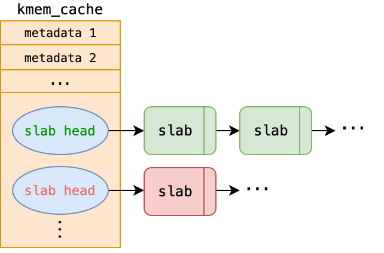

# MP2 Memory management: Kernel Memory Allocation (slab)

## 基本資訊

* 滿分: 125% (基本部分: 100%, 加分部分 25%)
* Release Date: 2025/03/18
* Due Date: 2025/04/01
* TA email: ntuos@googlegroups.com
* TA hours: Wed. 13-14 p.m., Fri. 11 a.m. -12 p.m., at B04

[TOC]


## Overview

在 MP2 作業中，我們將探討 **核心小型物件的記憶體配置與釋放機制**，並請學生在 `xv6` 作業系統上 **設計並實作 SLAB 分配器**。

本次作業的重點包括：
- **SLAB 分配器的資料結構設計**
- **小型物件分配的時間與空間效率優化**
- **與 SLAB 相關的多種優化技術**

透過本作業，學生將能夠體驗 **系統記憶體管理的設計與實作過程**，並學習如何提升核心記憶體配置的效率。

## 環境設定與準備

請確認以下步驟，以確保開發環境設置完成：

1. 確保已安裝 [Git](https://git-scm.com/)
2. 確保擁有 [GitHub 帳號](https://github.com/)，若無，請先註冊
3. 透過 MP2 專屬 [GitHub Classroom 連結]()，點擊 **Accept this assignment**，系統將為您建立專屬的作業倉庫 `mp2-<USERNAME>`
4. 存取您的 MP2 倉庫 `https://github.com/ntuos2025/mp2-<USERNAME>`
5. 在本地端克隆倉庫：
    ```bash
    git clone https://github.com/ntuos2025/mp2-<USERNAME>
    ```
6. 在倉庫內的 `student_id.txt` 檔案中填入您的學號，例如：
    ```log
    b12345678
    ```
7. 運行 `mp2.sh`，此腳本將準備 **`ntuos/mp2` 容器**：
    ```bash
    ./mp2.sh start
    ```
8. **(選擇性) 容器內 VS Code 開發環境設置：**
   
    - 安裝 [Docker](https://marketplace.visualstudio.com/items?itemName=ms-azuretools.vscode-docker) 及 [Dev Containers](https://marketplace.visualstudio.com/items?itemName=ms-vscode-remote.remote-containers) 擴充套件
    - 開啟 VS Code，進入 **Docker 側邊欄**，找到 `ntuos/mp2`
    - 右鍵點擊 **Attach Visual Studio Code**
    - 選擇 `ntuos/mp2`，此時 VS Code 會開啟新的開發環境，可直接於容器內進行開發
9. 測試環境是否正常運行：
    ```bash
    ./mp2.sh test
    ```

## 評分標準與繳交方式

### 評分標準

本作業總分 **125%**，其中包含 **基本要求與加分項目**。建議學生 **先完成基本實作，再挑戰額外的加分項目**。

#### 基本要求

- 除錯工具 (10%)
  - [`sys_printfslab`](#實作-system-call-sys_printfslab) 系統呼叫 (5%)
  - [`print_kmem_cache`](#print_kmem_cache-列印-struct-kmem_cache-的資訊) (5%)
- [SLAB 設計](#struct-slab-設計) (5%)
- 功能測試 (Public Tests) (45%)
  - [`kmem_cache_create`](#kmem_cache_create-創建-kmem_cache) (5%)
  - [`kmem_cache_alloc`](#kmem_cache_alloc-配置物件) (20%)
  - [`kmem_cache_alloc`](#kmem_cache_alloc-配置物件) + [`kmem_cache_free`](#kmem_cache_free-釋放物件) (20%)
- 隱藏測試 (Private Tests) (40%)

#### 加分項目

加分項目與基本要求不衝突，且加分項目不互相影響，可以選擇實現多個項目。

- [`struct slab` 記憶體優化](#struct-slab-設計) (+5%)
- [`kmem_cache` 內部碎裂優化](#kmem_cache-的內部碎裂問題-加分項目) (+10%)
- [以 `kernel/list.h` 管理 SLAB](#struct-slab-設計) (+10%)

### 提交與評分方式

所有程式碼將透過 git 繳交至 **GitHub Classroom**，請確保您的最終提交符合規範。

在截止時間之前可以繳交無數次，作業將透過我們準備好的 Github Action 自動評分，其會檢查提交紀錄與測試結果，並記錄最終得分。

最終得分將包含功能測試與隱藏測試，可至同學 mp2 的 Repository 中點選 Github Action 查看運行結果。

## 問題背景：核心記憶體管理的挑戰

想像今天 kernel 要分配 100 個大小為 `40B` 個系統物件，比如 xv6 中的 `struct file`。若每個物件都要以一個頁面儲存，不僅需要配置頁面時的開銷，還會遇到非常嚴重的內部碎裂問題，特別是面對小型系統物件的配置。

若能利用這些系統物件大小相同的特性，核心預先分配一個乃至數個連續的頁面，並將其內部空間以 `40B` 為單位進行切割，便能盡可能地利用整個頁面的空間，減少內部碎裂，由於可能短時間內對相同頁面重複訪問，且大多數的配置可以重複利用舊的頁面而非配置新頁面，也能加速配置所需的時間。

> 
> 回顧課程投影片。

Slab 便是這樣一個系統，源自 SunOS 原始碼，為過去 Linux kernel 實現小型系統物件記憶體配置的機制。本作業將引導學生 **設計並實作一個新的 Slab 記憶體配置系統**，以提升小型物件的記憶體管理效能。

題外話，MP2 的助教們所屬的實驗室簡稱為 NEWSLAB，可以斷句為 NewSlab，這便是我們 MP2 的目標！嗯...希望不要太冷。

## Slab 配置器的初步設計與 API

### Slab 配置器的初步設計

在 Slab 配置器的設計中，我們的目標是：

1. 為具有相同大小的核心物件分配頁面。
2. 將頁面切分為固定大小的物件，以提高記憶體使用效率。

為簡化設計，**假設核心一次僅能分配單一頁面**，而無法一次配置多個連續頁面。基於此假設，我們定義 `struct slab`，其大小等同於單個頁面，並包含物件的類別名稱 `name`、每個物件的大小 `object_size`，以及管理可用物件的 `freelist`。

```c
struct slab {
    char name[MP2_CACHE_MAX_NAME];
    uint object_size;
    void **freelist;
    ...
};
```

在 C 語言中，`void *` 表示指向任意類型的指標，然而由於其型別不確定，無法直接解引用，因此需要將其轉型為特定類型的指標才能進行操作。`(void *) *freelist` 代表一個 `void *` 陣列，或是一個指向 `void *` 的指標。關於 `freelist` 的詳細結構，將在[後續章節](#freelist-的資料結構)進一步說明。

由於對於相同類型的系統物件而言，`name` 和 `object_size` 皆為相同屬性，因此可在 `struct slab` 之上設計一個額外的結構體 `struct kmem_cache`，用來統一管理相同類型物件的共用資訊，藉此減少 `struct slab` 的記憶體開銷。

```c
struct slab {
    void **freelist;
    ... // 其他成員可依需求擴充
};

struct kmem_cache {
    char name[MP2_CACHE_MAX_NAME];
    uint object_size;
    struct slab *slab; // 記錄當前使用的 slab
    ... // 其他成員可依需求擴充
};
```

我們期望這些結構體能夠提供以下四項核心功能：

```c
// 初始化一個 slab 配置器，管理名稱為 name、大小為 object_size 的系統物件
struct kmem_cache *kmem_cache_create(char *name, uint object_size);

// 分配一個系統物件並回傳
void *kmem_cache_alloc(struct kmem_cache *cache);

// 釋放一個先前分配的系統物件 obj
void kmem_cache_free(struct kmem_cache *cache, void *obj);

// 銷毀 kmem_cache（不列入評分範圍）
void kmem_cache_destroy(struct kmem_cache *cache);
```

使用這些 API，其他核心開發者可透過以下方式進行記憶體管理：

```c
// 初始化 struct file 的 slab 配置器
struct kmem_cache *file_cache = kmem_cache_create("file", sizeof(struct file));

// 分配一個 struct file 物件
struct file *file_allocated = (struct file *) kmem_cache_alloc(file_cache);

// 釋放一個 struct file 物件
kmem_cache_free(file_cache, file2release);

// 當不再需要 file_cache 時，將其銷毀
kmem_cache_destroy(file_cache);
```

這是 MP2 作業中 Slab 配置器的介面設計，也是本次實作的核心目標。在接下來的章節中，我們將深入探討其具體實作細節。

### API 介面

本次作業應提供以下 slab API，以供 `xv6` 核心使用：

#### 1. `kmem_cache_create`

```c
struct kmem_cache *kmem_cache_create(const char *name, size_t size);
```
- **功能**: 初始化一個 `kmem_cache`，用於管理特定大小的物件。
- **參數**:
  - `name`：快取名稱 (供除錯與管理使用)。
  - `size`：物件大小 (單一物件的記憶體需求)。
- **回傳值**: 指向新建立的 `kmem_cache` 的指標。

#### 2. `kmem_cache_alloc`

```c
void *kmem_cache_alloc(struct kmem_cache *cache);
```
- **功能**: 從 `kmem_cache` 取得可用物件。
- **參數**:
  - `cache`：指向 `kmem_cache` 結構的指標。
- **回傳值**: 成功時回傳指向已分配物件的指標，失敗時回傳 `NULL`。

#### 3. `kmem_cache_free`

```c
void kmem_cache_free(struct kmem_cache *cache, void *obj);
```
- **功能**: 將物件歸還至 `kmem_cache`，使其可供後續分配。
- **參數**:
  - `cache`：指向 `kmem_cache` 結構的指標。
  - `obj`：指向待釋放物件的指標。

## Slab 配置器的實作的考量點

### `freelist` 資料結構

在閱讀前述內容後，您或許已經迫不及待地想在 `xv6` 中實作 SLAB 記憶體分配機制。然而，在實作過程中，**如何設計 `freelist` 資料結構** 將是一個關鍵挑戰。

首先，`freelist` 本質上是一塊連續的記憶體區域，亦即 **一個陣列**。對於任何陣列來說，獲取可用元素或釋放元素的時間複雜度通常為 $O(n)$，其中 $n$ 為 `freelist` 中可放置的的最大總物件數。然而，在追求高效能的 Linux 核心中，如此高的複雜度顯然不可接受。因此，我們需要採用 **更適合的資料結構** 來優化分配與釋放的時間。

### 鏈結串列的應用

學習過資料結構的讀者應該熟悉，**鏈結串列** 允許在 $O(1)$ 的時間內進行元素的移除和插入，可以分別用來實作物件的分配與釋放，這正是 `freelist` 的命名由來。我們可以將 `freelist` 視為一個尚未分配物件的鏈結串列，並透過以下方式進行操作：

- **分配物件**：從 `freelist` 取出第一個可用物件，並更新 `freelist` 指標。
- **釋放物件**：將釋放的物件插入 `freelist`。

如此一來，**物件分配與釋放的時間複雜度均為 $O(1)$**，大幅提升效能。

### 如何為連續記憶體建立鏈結串列？

一種直觀的做法是 **額外建立一個鏈結串列來記錄陣列中的可用記憶體地址**。假設原本的物件陣列為 `objects`，而 `freelist` 用於存放可用物件的地址，結構如下：

```c
struct slab {
    void **objects;
    void **freelist; // 鏈結串列，初始時記錄所有可用物件的地址
};
```

然而，這種設計存在兩個問題：

1. 需要額外的記憶體來存放 `freelist` 的鏈結節點。
2. `freelist` 本身的記憶體配置與管理問題依然尚未解決。

對這類問題，Linux 核心開發者常利用 C 語言 **一塊記憶體各自表述** 的技巧，直接將尚未分配的記憶體用於存儲鏈結串列的指標，最大限度地利用已經分配的記憶體。具體而言，**每個未使用的物件可以直接存放指向下一個可用物件的指標**，從而形成鏈結串列。概念上與前述設計相同，但能一次解決前述設計所遇到的問題。

假設系統物件的大小皆 **不小於一個指標的大小**，則我們可以安全地將 **尚未被分配的物件視為鏈結串列節點**。以下是 `freelist` 的運作示例：

```c
struct slab {
    void **freelist;
    ...
};

struct slab *s = ...;
// 取得第一個可用物件
void *free_obj = s->freelist;
// `free_obj` 的第一個指標大小的空間存放的是下一個可用物件的地址
void *next_free_obj = *(void **)free_obj;
// 重新解釋記憶體為具體的系統物件 (例如 struct file)
struct file *f = (struct file *) free_obj;
struct file *f_next = (struct file *) next_free_obj;
```

太多 `void *` 看起來很眼花撩亂嗎？xv6 中 [`kernel/kalloc.c`](../kernel/kalloc.c) 提供一個可讀性高的實作方式。

```c
// in kamlloc.c
// struct run 是將一塊記憶體解釋為一個有 next 成員的結構體
struct run {
    struct run *next;
};

struct {
    struct spinlock lock;
    struct run *freelist;
} kmem;
```

如此一來前面的用例可以等價的改寫為

```c
struct slab {
    struct run *freelist;
    ...
};

struct slab *s = ...;
// 取得第一個可用物件的指標
struct run *r = s->freelist;
// 由於第一個可用物件中 `next` 成員藏有下一個可用物件的地址
struct run *r_next = r->next;
// 重新解釋記憶體為特定的系統物件 (比如 struct file)
struct file *f = (struct file *) r;
struct file *f_after_f = (struct file *) r_next;
```

同學們也可以在一個核心物件的空間內放兩個指標，實現雙向鏈結串列。請根據 [Slab 配置器的實作要求](#slab-配置器的實作要求)，為 freelist 設計合適資料結構。

### `freelist` 的元素數量

考慮一個 slab 佔用一個頁面，`freelist` 中應該有

$$
\dfrac{\rm{Page\ size - Metadata\ size\ in\ a\ slab}}{\rm{Size\ of\ each\ object}}
$$

個元素。

### `kmem_cache` 資料結構

`kmem_cache` 是 Slab 配置器中負責管理同類型物件記憶體分配的核心結構，其雛形如下：

```c
struct slab {
    <ptr> freelist;
    ... // 其他欄位可依需求擴充
};

struct kmem_cache {
    char name[MP2_CACHE_MAX_NAME];
    uint object_size;

    struct slab *slab; // 指向當前使用的 struct slab

    ... // 其他欄位可依需求擴充
};
```

在系統設計中，需注意以下幾點：

- `struct kmem_cache` (以及 `struct slab`) 的大小為一個頁面，為固定值，無法動態調整。
- 為了提高記憶體分配效率，`struct kmem_cache` 應指向尚有可用空間的 Slab 清單，常見 Slab 清單分類如下：
  - **已滿 (`full`)**：所有物件皆已分配。
  - **部分使用 (`partial`)**：仍有可用物件。
  - **空閒 (`free`)**：尚未使用的 Slab。
- **當所有現有 Slab 皆已滿時，應配置新的頁面以產生額外的 Slab**。因此，儘管每個 `kmem_cache` 僅對應單一物件類型，其所管理的 Slab 數量可能會隨記憶體需求動態變化。

由於 `kmem_cache` 可能需動態管理大量 Slab，因此將 `kmem_cache::slab` 設計為陣列並不實際，改採 **鏈結串列** 會更符合需求。此設計可改進為：

```c
struct slab {
    <ptr> freelist;

    {   // Slab 清單鏈結指標
        <ptr> <next>;
        <ptr> <prev>; // 可選，視情境需求決定是否使用
    }
    ... // 其他欄位可依需求擴充
};

struct kmem_cache {
    char name[MP2_CACHE_MAX_NAME];
    uint object_size;

    <ptr> full;    // 指向已滿的 Slab 清單
    <ptr> partial; // 指向部分使用的 Slab 清單
    <ptr> free;    // 指向空閒的 Slab 清單

    ... // 其他欄位可依需求擴充
};
```

其中 `<ptr>` 可為 `struct slab *`、`void *`，或 `struct list_head` 等型別，後者為 Linux 風格的雙向鏈結串列管理方式，提供於 [`kernel/list.h`](../kernel/list.h)。如需瞭解 [`kernel/list.h`](../kernel/list.h) 的使用方式，請參考該檔案內的文檔註釋。採用該函式庫提供的 `struct list_head` 實作 slab 清單的同學將獲得加分機會。

### 核心物件、`struct slab` 與 `struct kmem_cache` 的關係

在 MP2 的 SLAB 配置器中，有三個關鍵角色，其關係應予以明確釐清。

#### 核心物件

核心所管理的資料結構，例如 `struct file`。每個核心物件的大小皆為固定長度。

#### `struct slab`

- **佔用單個頁面的記憶體區塊**，其中部分空間存放 Slab 的 **元數據 (metadata)**，其餘空間則被切割為大小相同的記憶體單元，形成 **`freelist` (可用物件清單)**。`freelist` 內的每個單元可存放一個核心物件。  
- **不同類型的核心物件會存放於對應類型的 Slab 中**，以確保管理的獨立性。  
- 根據已分配物件的數量，`struct slab` 可分為三種狀態：
  - 滿 (`full`)：所有可用物件均已分配。
  - 部分使用 (`partial`)：部分物件已被分配，仍有可用空間。
  - 閒置 (`free`)：目前無任何物件被分配，可完全釋放。  
- **定義「可用的 Slab」為處於 `partial` 或 `free` 狀態的 Slab**，這些 Slab 仍可提供物件分配。  
- **`struct slab` 依需求動態分配，並透過鏈結串列進行管理**，確保可靈活擴展。


上圖便是一個閒置的 slab 配置一個物件前後的狀態變化示意圖。配置完後變成一個部分使用的 slab。

此外，在 `kmem_cache_free` 的函式簽名中，僅提供 `struct kmem_cache *cache` 及核心物件指標 `void *obj` 的情況下，如何確定 `obj` 所屬的 `struct slab` 是一項重要的設計課題。請思考有哪些設計方案或技術可用於實現 `obj` 到 `slab` 的映射？

#### `struct kmem_cache`

- **負責管理所有屬於同一類型核心物件的 Slab**，確保記憶體分配與釋放的高效運行。  
- **例如，系統可能為 `struct file` 和 `struct proc` 各自建立一個 `kmem_cache`**，專門管理其對應的 Slab。(本次作業不涉及 `struct proc` 相關程式碼)



由上圖可見 `kmem_cache` 可能管理多個元數據，並管理一至多個 slab 鏈結序列。

#### `freelist` 與 `slab` 的關係 

有效存取 `freelist` 管理的記憶體空間，需對結構體與頁面記憶體的佈局有清晰的理解。下圖展示了 Slab 的記憶體佈局示意圖：  

  

請思考如何存取圖中各個物件對應的記憶體區域 (`space 0 ~ 7`)。  
提示：[指標運算 (Pointer Arithmetic)](https://www.open-std.org/jtc1/sc22/wg14/www/docs/n3220.pdf#subsection.6.5.7)。

### `kmem_cache` 的同步控制與競爭議題

在多核心與多執行緒環境中，`kmem_cache` 的操作涉及對 Slab 清單的修改與管理，因此可能會產生競爭條件 (race condition)。當多個 CPU 同時存取 `kmem_cache`，特別是在執行物件分配 (`kmem_cache_alloc()`) 或釋放 (`kmem_cache_free()`) 操作時，若未採取適當的同步機制，可能導致資料不一致或記憶體損壞。

為了確保 `kmem_cache` 的執行緒安全性，應使用適當的同步機制來保護關鍵區域。常見的解決方案包括：

- **自旋鎖 (`spinlock`)**：適用於短時間內的鎖定操作，避免進程切換開銷。
- **互斥鎖 (`mutex`)**：若操作時間較長，可使用互斥鎖來降低 busy waiting 的影響。
- **Per-CPU Cache**：透過每個 CPU 獨立的 `kmem_cache_cpu` 來減少跨 CPU 鎖競爭，僅在必要時進行全局同步。事實上這便是現今 Linux 核心采納之 slab 配置器的繼承者: slub 配置器的關鍵優化思路。

本作業只需要學生們以 **自旋鎖** 確保 `kmem_cache` 的執行性安全性。以下範例展示如何透過 `xv6` 提供的 **自旋鎖** 確保 `kmem_cache` 在多執行緒環境下的正確性：

```c
struct kmem_cache {
    ...
    struct spinlock lock;  // 用於同步管理 kmem_cache
};

void some_func() {
    struct kmem_cache *cache = kmem_cache_create(...);

    // 進入臨界區，防止競爭條件
    acquire(&cache->lock);
    
    // 可能產生競爭的關鍵操作
    cache->partial = NULL; 

    // 釋放鎖，結束臨界區
    release(&cache->lock);
}
```

在實作 slab 的功能以及應用 slab 於 `file.c` 時請務必注意執行緒安全議題。

### `kmem_cache` 的內部碎裂問題 (加分項目)

`struct kmem_cache` 本身屬於 **動態配置的系統物件**，通常佔用 **一個完整的頁面**，但其自身大小遠小於頁面大小，導致記憶體浪費。為解決此問題，可以將剩餘空間用來存放 Slab 內的可配置物件。

為了符合[實作規範](#print_kmem_cache-列印-struct-kmem_cache-的資訊)，請

* 將 `struct kmem_cache` 視為一個 `<slab_type>` 為 `cache` 的 slab。
* 列印的資訊中 `<slab_addr>` 直接對應 `struct kmem_cache` 自身在記憶體中的地址。
* 列印的資訊中 `<nxt_slab_addr>` 設為 `0x00...00`。

## 實作前需詳閱的資訊

### 檔案修改規則

- **請確保在 `student_id.txt` 檔案中填入您的學號**。  
- 以下分支中的受限制檔案 **禁止修改**：
  - **受限制的 Git 分支**：`ntuos/mp2-submit`
  - **受限制的檔案**：
    - `kernel/file.h`
    - `kernel/list.h`
    - `kernel/param.h`
    - `user/` 目錄內的所有程式碼  
  - **任何對 `ntuos/mp2-submit` 分支內受限制檔案的變更將視為違規行為，並導致該次作業評分為零**。  
  - 您可在其他 Git 分支進行修改。  
  - 允許在本機端對受限制檔案進行變更，但不得提交至受限制分支。  
- `kernel/file.c` 檔案修改規範：
  - **禁止修改** 任何 **以 `[FILE] ` 為前綴的除錯輸出程式碼**。  
  - 其他部分可進行調整，以**使 xv6 使用 `struct kmem_cache` 管理 `struct file`**。  
- 除上述限制外，學生可自由新增檔案或修改其他程式碼。

### 簡易核心除錯器

在大型軟體專案中，為新增功能除錯是一項極具挑戰性的工作。為此，許多專案內建了日誌記錄或除錯系統，以協助開發人員進行問題排查。然而，xv6 **僅提供基本的輸出功能**，如 `printf`，這對於除錯與測試而言較為受限。因此，我們提供了一個 **簡易核心除錯系統**，以提升除錯效率與測試靈活性，請同學們善加利用。

本除錯系統的使用方式與 `printf` 介面完全相容，可用於格式化輸出，且提供額外的控制選項。

```c
// in file.c
#include "debug.h" // 引入核心除錯工具
// 格式化輸出
debug("tp: %d, ref: %d, readable: %d, ...",
      file->type, file->ref, file->readable, ...);
// 普通字串輸出
debug("[FILE] filealloc");
```

在本次 MP2 作業中，所有同學們的輸出 **必須透過 `debug` 巨集函式**，以確保測試與評分系統的正確運行。請務必嚴格遵守此要求，否則可能導致測試結果無法對應，影響成績。

詳細使用方式請參閱 [`kernel/debug.h`](../kernel/debug.h) 核心文件。

### 動態切換除錯模式

我們在 xv6 中提供了 `debugswitch` 命令，允許開發人員 **透過命令行切換除錯模式**。執行 `debugswitch` 後，系統將在 **開啟/關閉除錯輸出** 之間切換，便於測試與診斷。

以下為 `debugswitch` 的範例執行結果：
```sh
xv6 kernel is booting

[FILE] fileinit
hart 2 starting
hart 1 starting
[FILE] filealloc
init: starting sh
[FILE] filealloc
[FILE] fileclose
$ debugswitch
Switch debug mode to 0
$ ls
.              1 1 1024
..             1 1 1024
README         2 2 2292
cat            2 3 34728
...
console        3 22 0
$ debugswitch
Switch debug mode to 1
$ ls
[FILE] filealloc
[FILE] filealloc
[FILE] fileclose
.              1 1 1024
[FILE] filealloc
[FILE] fileclose
..             1 1 1024
[FILE] filealloc
[FILE] fileclose
README         2 2 2292
...
[FILE] filealloc
[FILE] fileclose
console        3 22 0
[FILE] fileclose
```

### 調整預設除錯模式

預設的除錯模式可透過 [`param.h`](../kernel/param.h) 進行設定。  
開發時，同學們可根據需求調整本機的除錯模式，但 **請確保提交至 GitHub 的 `MP2_DEFAULT_DEBUG_MODE` 為 `1`**，即 **開啟除錯模式**，以確保評分系統的正確性。

```c
// in param.h
#define MP2_DEFAULT_DEBUG_MODE 1 // 預設開啟除錯模式
```

## 實作要求

本作業提供學生們高度的靈活性，允許對 `slab` 進行自訂設計，只需遵循以下規範。

### `struct slab` 設計

請設計 `struct slab` 資料結構。由於核心開發者通常傾向於最大化記憶體利用率，因此建議學生最小化 `struct slab` 的記憶體佔用，以提升對記憶體空間的利用率。

```c
struct slab {
    <ptr> freelist;

    {
        <ptr> <next>;
        <ptr> <prev>;
    }
    ... // 允許學生自由擴展
};
```

`struct slab` 的設計將依據以下三個標準進行評分：

1. **`struct slab` 本身的記憶體大小** (最高 8%)
   定義 `struct slab` 的大小因子 $v(s)$ 如下：
   $$
   v(s) = \dfrac{sizeof(\tt{struct\ slab})}{sizeof(\tt{void *})}
   $$
   評分標準如下：

   | `v(s)` | 分數 |
   |--------|------|
   | $\le$ 3    | 3% + 5% |
   | 4      | 3% + 2% |
   | 5      | 3% |
   | 6      | 2% |
   | 7      | 1% |
   | $\ge$ 8    | 0% |

2. **`slab::freelist` 中可容納的物件數量** (2%)
   在測試過程中，`struct file` 的大小為 504 Bytes，評分標準如下：

   | 可容納 `struct file` 數量 | 分數 |
   |-------------------------|------|
   | 8                       | 2%  |
   | 7                       | 1%  |
   | $\le$ 6                 | 0%  |

3. 使用 `struct list_head` 進行 Slab 管理 (加 10%)
   - 需在 `struct slab` 中 **使用 [`struct list_head`](../kernel/list.h) 維護 Slab 間的鏈結**。
   - 同學的程式碼 **需在功能測試的部分取得滿分 (45%)** 才會獲得這部分額外 10% 的加分

### `struct kmem_cache` 的設計

```c
struct kmem_cache {
    char name[MP2_CACHE_MAX_NAME];
    uint object_size;
    struct spinlock lock;

    <ptr> full; // 全滿 (可選)
    <ptr> partial; // 部分使用中
    <ptr> free; // 閒置 (可選)

    ... // 允許學生自由擴展
};
```

請同學留意以下幾點：

1. 閒置 Slab 釋放機制

   為了減少過多閒置 Slab 的記憶體浪費，當可用 Slab（即 `partial + free`）的總數超過 [`param.h`](../kernel/param.h) 中定義的 `MP2_MIN_AVAIL_SLAB` 時，若有新的 Slab 變為完全閒置（`free`），則應主動釋放其佔用的記憶體。該機制將透過 `kmem_cache_free` 進行測試。
2. 內部碎裂優化

   由於[內部碎裂問題](#kmem_cache-的內部碎裂問題)，若透過 `kmem_cache` 的內部空間進行物件的配置與釋放（即將這些物件的 `<slab_addr>` 設為 `kmem_cache` 的地址），可獲得額外 **7%** 的加分。

3. `full` 和 `free` 的可選性
   `kmem_cache` 的 `full` 與 `free` 變數為可選項，學生可以參考 [Linux Kernel 中 SLUB 的設計方式](https://github.com/torvalds/linux/blob/0fed89a961ea851945d23cc35beb59d6e56c0964/mm/slub.c#L154)，或採用其他適合的實作方法，只要符合[實作規範](#print_kmem_cache-列印-struct-kmem_cache-的資訊)，即可獲得相應評分。

### Slab 提供的功能

請在 [`slab.c`](./kernel/slab.c) 中實作以下函式：

```c
// 1. Slab 記憶體管理核心函式
// 1-1. 初始化 Slab 配置器，為類型名稱為 name 的系統物件 (大小為 object_size) 創建一個 kmem_cache
struct kmem_cache *kmem_cache_create(char *name, uint object_size);
// 1-2. 配置一個系統物件並返回其記憶體地址
void *kmem_cache_alloc(struct kmem_cache *cache);
// 1-3. 釋放指定的系統物件 (obj)
void kmem_cache_free(struct kmem_cache *cache, void *obj);
// 1-4. 銷毀 kmem_cache
void kmem_cache_destroy(struct kmem_cache *cache);

// 2. 除錯用函式
void print_kmem_cache(struct kmem_cache *, void (*)(void *));
```

上述所有 Slab 記憶體管理功能，在輸出訊息時，皆應使用 `[SLAB] ` 作為前綴。例如：

```log
[SLAB] Alloc request on cache file
```

### `kmem_cache_create`: 創建 `kmem_cache`

在成功創建並返回 `kmem_cache` 之前，請輸出以下資訊：

```log
[SLAB] New kmem_cache (name: <name>, object size: <obj_size> bytes, max objects per slab: <max_objs>) is created
```

- **`<name>`**：新建的 `kmem_cache` 之名稱 (`kmem_cache::name`)。
- **`<obj_size>`**：該 `kmem_cache` 內部物件的大小 (`kmem_cache::object_size`，單位為 Bytes)。
- **`<max_objs>`**：一個 `slab` 中能容納物件的最大數量。

### `kmem_cache_alloc`: 配置物件

在配置物件時，請依照以下流程圖執行，並輸出相應資訊。請將 **尖括號 (`<>`) 內的變數替換為實際數值**，並確保每行輸出皆以 `[SLAB] ` 為前綴，每個字中間間隔一個空白。


- **`<name>`**：`kmem_cache` 的名稱 (`kmem_cache::name`)。
- **`<slab_addr>`**：該物件所屬 Slab 的記憶體地址。
- **`<obj_addr>`**：配置的物件所在記憶體地址。

除此之外，同學們也可以列印其他自訂的除錯訊息，只要不和流程圖中出現的列印格式相衝突即可。建議以其他前綴 (比如小寫的 `[slab]` 等) 列印自定義的除錯訊息。

### `kmem_cache_free`: 釋放物件

在釋放物件時，請依照以下流程圖執行，並輸出相應資訊。請確保輸出符合規範，並替換 **尖括號 (`<>`) 內的變數**，所有訊息均需加上 `[SLAB] ` 前綴，每個字中間間隔一個空白。


- **`<name>`**：`kmem_cache` 的名稱 (`kmem_cache::name`)。
- **`<slab_addr>`**：該物件所屬 Slab 的記憶體地址。
- **`<obj_addr>`**：待釋放的物件所在記憶體地址。
- **`<before>`**：物件所屬 Slab 在釋放前的狀態 (`full/partial/free/cache`)。
- **`<after>`**：物件所屬 Slab 在釋放後的狀態 (`full/partial/free/cache`)。

此外，若 **(`partial` + `free` Slab 數量) 超過 `MP2_MIN_AVAIL_SLAB`**，且該物件所在 Slab 變為完全閒置 (`free`)，則應釋放該 Slab 以回收記憶體。

除此之外，同學們也可以列印其他自訂的除錯訊息，只要不和流程圖中出現的列印格式相衝突即可。建議以其他前綴 (比如小寫的 `[slab]` 等) 列印自定義的除錯訊息。

### 將 slab 配置器應用於 `struct file` 的管理

在 xv6 中，原本負責管理 `struct file` 的結構為 `file.c` 中的 `ftable`。請將其替換為 `struct kmem_cache *file_cache`，並相應調整 `file.c` 的實現。

在 `file.[h,c]` 中，已為同學添加以下程式碼：

```c
// file.h
#include "kernel/param.h"
#include "kernel/slab.h"

struct file {
  ...
#ifdef MP2_TEST
  int fat_element[MP2_FILE_MAGIC_N];
#endif // _MP2_TEST_
};

extern struct kmem_cache *file_cache;
// 列印檔案物件的元資料
void fileprint_metadata(void *f);

// file.c
#include "kernel/debug.h"
void fileprint_metadata(void *f) {
  struct file *file = (struct file *) f;
  debug("tp: %d, ref: %d, readable: %d, writable: %d, pipe: %p, ip: %p, off: %d, major: %d",
         file->type, file->ref, file->readable, file->writable, file->pipe, file->ip, file->off, file->major);
}

struct kmem_cache *file_cache;

void
fileinit(void)
{
  debug("[FILE] fileinit\n");
  // ...
}

// Allocate a file structure.
struct file*
filealloc(void)
{
  debug("[FILE] filealloc\n");
  // ...
}

// ...

void
fileclose(struct file *f)
{
  // ...
  debug("[FILE] fileclose\n");
  ff = *f;
  f->ref = 0;
  // ...
}
```

請同學們 **不要更動** 在 `file.c` 中添加的 **列印相關程式碼**，在 `fileinit`、`filealloc` 和 `fileclose` (ref 降至 0 時) 應該印出以 `[FILE] ` 為前綴的除錯訊息。

### `print_kmem_cache` 列印 `struct kmem_cache` 的資訊

在列印 `struct kmem_cache` 時，應根據 `struct slab` 內剩餘可分配物件的數量，將 `struct slab` 分類為 `<slab_type>`（例如 `full`、`partial` 等）。

輸出的資訊分為五類：

#### 1. `<kmem_cache_status>`：`kmem_cache` 的基本資訊

```log
[SLAB] kmem_cache { name: <name>, obj_size: <object_size>, in_cache_obj: <in_cache_obj> }
```
- `<name>`：`kmem_cache` 的名稱（對應 `kmem_cache::name`）。
- `<obj_size>`：`kmem_cache` 內單個物件的大小（對應 `kmem_cache::object_size`）。
- `<in_cache_obj>`：是否實作[內部碎裂問題](#kmem_cache-的內部碎裂問題-加分項目)，是則為 `1`，否則為 `0。

#### 2. `<slab_list_status>`：Slab 清單狀態

```log
[SLAB] <SPACE>[ <slab_type><SPACE>slabs ]
```
- `<SPACE>`：至少一個空格 (` `) 或 `\t`。
- `<slab_type>`：Slab 類型，可為 `full`、`partial`、`free` 或 [`cache`](#kmem_cache-的內部碎裂問題)。
- **`full` 和 `free` 的 Slab 可透過推論確定，故無須輸出。**

#### 3. `<slab_status>`：單個 Slab 狀態

```log
[SLAB] <SPACE>[ slab <slab_addr> ] { freelist: <freelist>, nxt: <next_slab_addr> }
```

- `<SPACE>`：至少一個空格 (` `) 或 `\t`。
- `<slab_addr>`：Slab 在記憶體中的地址。
- `<freelist>`：該 Slab 內部 `freelist` 的起始地址。
- `<nxt_slab_addr>`：該 Slab 在鏈結串列中的下一個 Slab 地址。

#### 4. `<obj_status>`：單個核心物件的狀態 

```log
[SLAB] <SPACE>[ idx <idx> ] { addr: <entry_addr>, as_ptr: <as_ptr>, as_obj: {<as_obj>} }
```
- `<SPACE>`：至少一個空格 (` `) 或 `\t`。
- `<idx>`：物件在其所屬 Slab 內的索引（按記憶體地址遞增順序）。
- `<entry_addr>`：該物件的記憶體地址，應依 `slab::freelist` 內地址順序輸出。
- `<as_ptr>`：將該物件解釋為指標後的值。
- `<as_obj>`：將該物件作為系統物件解析並輸出（對應 `slab_obj_printer` 的輸出）。

### 5. `<print_kmem_cache_end>`：函式終止符號

```log
[SLAB] print_kmem_cache end
```

#### 輸出格式範例

```log
[SLAB] <kmem_cache_status>
[SLAB] <slab_list_status 0>
[SLAB] <slab_status 0>
[SLAB] <obj_status 0>
[SLAB] <obj_status 1>
[SLAB] ...
[SLAB] <obj_status n>
[SLAB] <slab_status 1>
[SLAB] <obj_status 0>
[SLAB] <obj_status 1>
[SLAB] ...
[SLAB] <obj_status n>
[SLAB] <slab_list_status 1>
[SLAB] <slab_status 0>
[SLAB] <obj_status 0>
[SLAB] <obj_status 1>
[SLAB] ...
[SLAB] <obj_status n>
[SLAB] <slab_status 1>
[SLAB] <obj_status 0>
[SLAB] <obj_status 1>
[SLAB] ...
[SLAB] <obj_status n>
[SLAB] ...
[SLAB] ...
[SLAB] ...
[SLAB] <print_kmem_cache_end>
```

舉例如下。

<pre style="border: 1px solid #e8e8e8;padding: 10px;border-radius: 4px;font-size: 5.2px;line-height: 1.5;overflow-x: auto;white-space: pre-wrap;"><code>[SLAB] kmem_cache { name: file, object_size: 504, in_cache_obj: 0 }
[SLAB]    [ partial slabs ]
[SLAB]        [ slab 0x0000000087f4e000 ] { freelist: 0x0000000087f4e218, in_use: 1, prev: 0x0000000087f59040, nxt: 0x0000000087f59040 }
[SLAB]           [ idx 0 ] { addr: 0x0000000087f4e020, as_ptr: 0x0000000900000003, as_obj: { tp: 3, ref: 9, readable: 1, writable: 1, pipe: 0x0000000000000000, ip: 0x00000000800354c8, off: 0, major: 1 } }
[SLAB]           [ idx 1 ] { addr: 0x0000000087f4e218, as_ptr: 0x0000000087f4e410, as_obj: { tp: -2013993968, ref: 0, readable: 1, writable: 0, pipe: 0x0000000000000000, ip: 0x0000000080035440, off: 1024, major: 0 } }
[SLAB]           [ idx 2 ] { addr: 0x0000000087f4e410, as_ptr: 0x0000000087f4e608, as_obj: { tp: -2013993464, ref: 0, readable: 1, writable: 0, pipe: 0x0000000000000000, ip: 0x00000000800354c8, off: 0, major: 1 } }
[SLAB]           [ idx 3 ] { addr: 0x0000000087f4e608, as_ptr: 0x0000000087f4e800, as_obj: { tp: -2013992960, ref: 0, readable: 5, writable: 5, pipe: 0x0505050505050505, ip: 0x0505050505050505, off: 84215045, major: 1285 } }
[SLAB]           [ idx 4 ] { addr: 0x0000000087f4e800, as_ptr: 0x0000000087f4e9f8, as_obj: { tp: -2013992456, ref: 0, readable: 5, writable: 5, pipe: 0x0505050505050505, ip: 0x0505050505050505, off: 84215045, major: 1285 } }
[SLAB]           [ idx 5 ] { addr: 0x0000000087f4e9f8, as_ptr: 0x0000000087f4ebf0, as_obj: { tp: -2013991952, ref: 0, readable: 5, writable: 5, pipe: 0x0505050505050505, ip: 0x0505050505050505, off: 84215045, major: 1285 } }
[SLAB]           [ idx 6 ] { addr: 0x0000000087f4ebf0, as_ptr: 0x0000000087f4ede8, as_obj: { tp: -2013991448, ref: 0, readable: 5, writable: 5, pipe: 0x0505050505050505, ip: 0x0505050505050505, off: 84215045, major: 1285 } }
[SLAB]           [ idx 7 ] { addr: 0x0000000087f4ede8, as_ptr: 0x0000000000000000, as_obj: { tp: 0, ref: 0, readable: 5, writable: 5, pipe: 0x0505050505050505, ip: 0x0505050505050505, off: 84215045, major: 1285 } }
[SLAB] print_kmem_cache end
</code></pre>

<pre style="border: 1px solid #e8e8e8;padding: 10px;border-radius: 4px;font-size: 5.2px;line-height: 1.5;overflow-x: auto;white-space: pre-wrap;"><code>[SLAB] kmem_cache { name: file, object_size: 504, in_cache_obj: 0 }
[SLAB]    [ partial slabs ]
[SLAB]        [ slab 0x0000000087e5d000 ] { freelist: 0x0000000087e5d020, in_use: 0, prev: 0x0000000087f59040, nxt: 0x0000000087f4e008 }
[SLAB]           [ idx 0 ] { addr: 0x0000000087e5d020, as_ptr: 0x0000000087e5d410, as_obj: { tp: -2014981104, ref: 0, readable: 1, writable: 0, pipe: 0x0000000000000000, ip: 0x0000000080035440, off: 1024, major: 0 } }
[SLAB]           [ idx 1 ] { addr: 0x0000000087e5d218, as_ptr: 0x0000000000000000, as_obj: { tp: 0, ref: 0, readable: 0, writable: 1, pipe: 0x0000000087e5c000, ip: 0x0000000000000000, off: 0, major: 0 } }
[SLAB]           [ idx 2 ] { addr: 0x0000000087e5d410, as_ptr: 0x0000000087e5d800, as_obj: { tp: -2014980096, ref: 0, readable: 1, writable: 0, pipe: 0x0000000000000000, ip: 0x0000000080035550, off: 0, major: 0 } }
[SLAB]           [ idx 3 ] { addr: 0x0000000087e5d608, as_ptr: 0x0000000087e5d218, as_obj: { tp: -2014981608, ref: 0, readable: 0, writable: 1, pipe: 0x0000000087e20000, ip: 0x0000000000000000, off: 0, major: 0 } }
[SLAB]           [ idx 4 ] { addr: 0x0000000087e5d800, as_ptr: 0x0000000087e5dbf0, as_obj: { tp: -2014979088, ref: 0, readable: 1, writable: 0, pipe: 0x0000000087de5000, ip: 0x0000000000000000, off: 0, major: 0 } }
[SLAB]           [ idx 5 ] { addr: 0x0000000087e5d9f8, as_ptr: 0x0000000087e5d608, as_obj: { tp: -2014980600, ref: 0, readable: 0, writable: 1, pipe: 0x0000000087de5000, ip: 0x0000000000000000, off: 0, major: 0 } }
[SLAB]           [ idx 6 ] { addr: 0x0000000087e5dbf0, as_ptr: 0x0000000087e5dde8, as_obj: { tp: -2014978584, ref: 0, readable: 1, writable: 0, pipe: 0x0000000087daa000, ip: 0x0000000000000000, off: 0, major: 0 } }
[SLAB]           [ idx 7 ] { addr: 0x0000000087e5dde8, as_ptr: 0x0000000087e5d9f8, as_obj: { tp: -2014979592, ref: 0, readable: 0, writable: 1, pipe: 0x0000000000000000, ip: 0x00000000800355d8, off: 5, major: 0 } }
[SLAB]        [ slab 0x0000000087f4e000 ] { freelist: 0x0000000087f4e218, in_use: 1, prev: 0x0000000087e5d008, nxt: 0x0000000087f59040 }
[SLAB]           [ idx 0 ] { addr: 0x0000000087f4e020, as_ptr: 0x0000000900000003, as_obj: { tp: 3, ref: 9, readable: 1, writable: 1, pipe: 0x0000000000000000, ip: 0x00000000800354c8, off: 0, major: 1 } }
[SLAB]           [ idx 1 ] { addr: 0x0000000087f4e218, as_ptr: 0x0000000087f4e608, as_obj: { tp: -2013993464, ref: 0, readable: 1, writable: 0, pipe: 0x0000000087f42000, ip: 0x0000000000000000, off: 0, major: 0 } }
[SLAB]           [ idx 2 ] { addr: 0x0000000087f4e410, as_ptr: 0x0000000087f4ebf0, as_obj: { tp: -2013991952, ref: 0, readable: 1, writable: 0, pipe: 0x0000000087eeb000, ip: 0x0000000000000000, off: 0, major: 0 } }
[SLAB]           [ idx 3 ] { addr: 0x0000000087f4e608, as_ptr: 0x0000000087f4e410, as_obj: { tp: -2013993968, ref: 0, readable: 1, writable: 0, pipe: 0x0000000087ee5000, ip: 0x0000000000000000, off: 0, major: 0 } }
[SLAB]           [ idx 4 ] { addr: 0x0000000087f4e800, as_ptr: 0x0000000087f4e9f8, as_obj: { tp: -2013992456, ref: 0, readable: 0, writable: 1, pipe: 0x0000000000000000, ip: 0x00000000800355d8, off: 5, major: 0 } }
[SLAB]           [ idx 5 ] { addr: 0x0000000087f4e9f8, as_ptr: 0x0000000000000000, as_obj: { tp: 0, ref: 0, readable: 0, writable: 1, pipe: 0x0000000087eeb000, ip: 0x0000000000000000, off: 0, major: 0 } }
[SLAB]           [ idx 6 ] { addr: 0x0000000087f4ebf0, as_ptr: 0x0000000087f4ede8, as_obj: { tp: -2013991448, ref: 0, readable: 1, writable: 0, pipe: 0x0000000087e98000, ip: 0x0000000000000000, off: 0, major: 0 } }
[SLAB]           [ idx 7 ] { addr: 0x0000000087f4ede8, as_ptr: 0x0000000087f4e800, as_obj: { tp: -2013992960, ref: 0, readable: 0, writable: 1, pipe: 0x0000000000000000, ip: 0x0000000080035550, off: 5, major: 0 } }
[SLAB] print_kmem_cache end
</code></pre>

<pre style="border: 1px solid #e8e8e8;padding: 10px;border-radius: 4px;font-size: 5.2px;line-height: 1.5;overflow-x: auto;white-space: pre-wrap;"><code>[SLAB] kmem_cache { name: file, object_size: 504, in_cache_obj: 1 }
[SLAB]    [ cache    slabs ]
[SLAB]        [ slab 0x0000000087f59000 ] { freelist: 0x0000000087f59268, nxt: 0x0000000000000000 }
[SLAB]           [ idx 0 ] { addr: 0x0000000087f59070, as_ptr: 0x0000000900000003, as_obj: { tp: 3, ref: 9, readable: 1, writable: 1, pipe: 0x0505050505050505, ip: 0x0000000080035558, off: 84215045, major: 1 } }
[SLAB]           [ idx 1 ] { addr: 0x0000000087f59268, as_ptr: 0x0000000087f59460, as_obj: { tp: -2013948832, ref: 0, readable: 1, writable: 0, pipe: 0x0505050505050505, ip: 0x00000000800354d0, off: 1024, major: 1 } }
[SLAB]           [ idx 2 ] { addr: 0x0000000087f59460, as_ptr: 0x0000000087f59658, as_obj: { tp: -2013948328, ref: 0, readable: 1, writable: 0, pipe: 0x0505050505050505, ip: 0x0000000080035558, off: 0, major: 1 } }
[SLAB]           [ idx 3 ] { addr: 0x0000000087f59658, as_ptr: 0x0000000087f59850, as_obj: { tp: -2013947824, ref: 0, readable: 5, writable: 5, pipe: 0x0505050505050505, ip: 0x0505050505050505, off: 84215045, major: 1285 } }
[SLAB]           [ idx 4 ] { addr: 0x0000000087f59850, as_ptr: 0x0000000087f59a48, as_obj: { tp: -2013947320, ref: 0, readable: 5, writable: 5, pipe: 0x0505050505050505, ip: 0x0505050505050505, off: 84215045, major: 1285 } }
[SLAB]           [ idx 5 ] { addr: 0x0000000087f59a48, as_ptr: 0x0000000087f59c40, as_obj: { tp: -2013946816, ref: 0, readable: 5, writable: 5, pipe: 0x0505050505050505, ip: 0x0505050505050505, off: 84215045, major: 1285 } }
[SLAB]           [ idx 6 ] { addr: 0x0000000087f59c40, as_ptr: 0x0000000000000000, as_obj: { tp: 0, ref: 0, readable: 5, writable: 5, pipe: 0x0505050505050505, ip: 0x0505050505050505, off: 84215045, major: 1285 } }
[SLAB] print_kmem_cache end
</code></pre>

<pre style="border: 1px solid #e8e8e8;padding: 10px;border-radius: 4px;font-size: 5.2px;line-height: 1.5;overflow-x: auto;white-space: pre-wrap;"><code>[SLAB] kmem_cache { name: file, object_size: 504, in_cache_obj: 1 }
[SLAB]    [ cache    slabs ]
[SLAB]        [ slab 0x0000000087f59000 ] { freelist: 0x0000000087f59268, nxt: 0x0000000000000000 }
[SLAB]           [ idx 0 ] { addr: 0x0000000087f59070, as_ptr: 0x0000000900000003, as_obj: { tp: 3, ref: 9, readable: 1, writable: 1, pipe: 0x0505050505050505, ip: 0x0000000080035558, off: 84215045, major: 1 } }
[SLAB]           [ idx 1 ] { addr: 0x0000000087f59268, as_ptr: 0x0000000087f59658, as_obj: { tp: -2013948328, ref: 0, readable: 1, writable: 0, pipe: 0x0000000087f43000, ip: 0x00000000800354d0, off: 1024, major: 1 } }
[SLAB]           [ idx 2 ] { addr: 0x0000000087f59460, as_ptr: 0x0000000087f59850, as_obj: { tp: -2013947824, ref: 0, readable: 1, writable: 0, pipe: 0x0000000087e19000, ip: 0x0000000080035558, off: 0, major: 1 } }
[SLAB]           [ idx 3 ] { addr: 0x0000000087f59658, as_ptr: 0x0000000087f59a48, as_obj: { tp: -2013947320, ref: 0, readable: 1, writable: 0, pipe: 0x0000000087eec000, ip: 0x00000000800355e0, off: 0, major: 1 } }
[SLAB]           [ idx 4 ] { addr: 0x0000000087f59850, as_ptr: 0x0000000087f59c40, as_obj: { tp: -2013946816, ref: 0, readable: 0, writable: 1, pipe: 0x0000000087eec000, ip: 0x0000000080035668, off: 5, major: 1285 } }
[SLAB]           [ idx 5 ] { addr: 0x0000000087f59a48, as_ptr: 0x0000000087f59460, as_obj: { tp: -2013948832, ref: 0, readable: 1, writable: 0, pipe: 0x0000000087ead000, ip: 0x0505050505050505, off: 84215045, major: 1285 } }
[SLAB]           [ idx 6 ] { addr: 0x0000000087f59c40, as_ptr: 0x0000000000000000, as_obj: { tp: 0, ref: 0, readable: 0, writable: 1, pipe: 0x0000000087ead000, ip: 0x00000000800355e0, off: 5, major: 1285 } }
[SLAB]    [ partial slabs ]
[SLAB]        [ slab 0x0000000087e74000 ] { freelist: 0x0000000087e74020, nxt: 0x0000000087da2008 }
[SLAB]           [ idx 0 ] { addr: 0x0000000087e74020, as_ptr: 0x0000000087e74410, as_obj: { tp: -2014886896, ref: 0, readable: 1, writable: 0, pipe: 0x0000000087e73000, ip: 0x0000000000000000, off: 0, major: 0 } }
[SLAB]           [ idx 1 ] { addr: 0x0000000087e74218, as_ptr: 0x0000000000000000, as_obj: { tp: 0, ref: 0, readable: 0, writable: 1, pipe: 0x0000000087e73000, ip: 0x0000000000000000, off: 0, major: 0 } }
[SLAB]           [ idx 2 ] { addr: 0x0000000087e74410, as_ptr: 0x0000000087e749f8, as_obj: { tp: -2014885384, ref: 0, readable: 1, writable: 0, pipe: 0x0000000087f34000, ip: 0x0000000000000000, off: 0, major: 0 } }
[SLAB]           [ idx 3 ] { addr: 0x0000000087e74608, as_ptr: 0x0000000087e74218, as_obj: { tp: -2014887400, ref: 0, readable: 0, writable: 1, pipe: 0x0000000087f34000, ip: 0x0000000000000000, off: 0, major: 0 } }
[SLAB]           [ idx 4 ] { addr: 0x0000000087e74800, as_ptr: 0x0000000087e74608, as_obj: { tp: -2014886392, ref: 0, readable: 0, writable: 1, pipe: 0x0000000087e19000, ip: 0x0000000000000000, off: 0, major: 0 } }
[SLAB]           [ idx 5 ] { addr: 0x0000000087e749f8, as_ptr: 0x0000000087e74de8, as_obj: { tp: -2014884376, ref: 0, readable: 1, writable: 0, pipe: 0x0000000087ddd000, ip: 0x0000000000000000, off: 0, major: 0 } }
[SLAB]           [ idx 6 ] { addr: 0x0000000087e74bf0, as_ptr: 0x0000000087e74800, as_obj: { tp: -2014885888, ref: 0, readable: 0, writable: 1, pipe: 0x0000000000000000, ip: 0x0000000080035778, off: 5, major: 0 } }
[SLAB]           [ idx 7 ] { addr: 0x0000000087e74de8, as_ptr: 0x0000000087e74bf0, as_obj: { tp: -2014884880, ref: 0, readable: 1, writable: 0, pipe: 0x0000000087da1000, ip: 0x0000000000000000, off: 0, major: 0 } }
[SLAB]        [ slab 0x0000000087da2000 ] { freelist: 0x0000000087da2218, nxt: 0x0000000087f59040 }
[SLAB]           [ idx 0 ] { addr: 0x0000000087da2020, as_ptr: 0x0000000087da2de8, as_obj: { tp: -2015744536, ref: 0, readable: 0, writable: 1, pipe: 0x0000000087da1000, ip: 0x0000000000000000, off: 0, major: 0 } }
[SLAB]           [ idx 1 ] { addr: 0x0000000087da2218, as_ptr: 0x0000000087da2608, as_obj: { tp: -2015746552, ref: 0, readable: 1, writable: 0, pipe: 0x0000000087ee6000, ip: 0x0000000000000000, off: 0, major: 0 } }
[SLAB]           [ idx 2 ] { addr: 0x0000000087da2410, as_ptr: 0x0000000087da2020, as_obj: { tp: -2015748064, ref: 0, readable: 0, writable: 1, pipe: 0x0000000087ee6000, ip: 0x0000000000000000, off: 0, major: 0 } }
[SLAB]           [ idx 3 ] { addr: 0x0000000087da2608, as_ptr: 0x0000000087da29f8, as_obj: { tp: -2015745544, ref: 0, readable: 1, writable: 0, pipe: 0x0000000087d99000, ip: 0x0000000000000000, off: 0, major: 0 } }
[SLAB]           [ idx 4 ] { addr: 0x0000000087da2800, as_ptr: 0x0000000087da2410, as_obj: { tp: -2015747056, ref: 0, readable: 0, writable: 1, pipe: 0x0000000087d99000, ip: 0x0000000000000000, off: 0, major: 0 } }
[SLAB]           [ idx 5 ] { addr: 0x0000000087da29f8, as_ptr: 0x0000000087da2bf0, as_obj: { tp: -2015745040, ref: 0, readable: 1, writable: 0, pipe: 0x0000000087d48000, ip: 0x0000000000000000, off: 0, major: 0 } }
[SLAB]           [ idx 6 ] { addr: 0x0000000087da2bf0, as_ptr: 0x0000000087da2800, as_obj: { tp: -2015746048, ref: 0, readable: 0, writable: 1, pipe: 0x0000000087d48000, ip: 0x0000000000000000, off: 0, major: 0 } }
[SLAB]           [ idx 7 ] { addr: 0x0000000087da2de8, as_ptr: 0x0000000000000000, as_obj: { tp: 0, ref: 0, readable: 0, writable: 1, pipe: 0x0000000000000000, ip: 0x00000000800355e0, off: 5, major: 0 } }
[SLAB] print_kmem_cache end
</code></pre>

### 實作 system call `sys_printfslab`

請同學們實現 `sys_printfslab`，印出 file 之 slab (`struct kmem_cache`) 的系統呼叫。

請確保下列 user program 能正常運行。

```c
#include "kernel/types.h"
#include "user/user.h"

int main(int argc, char *argv[])
{
  printfslab();
}
```

上述程式碼只要能被正常編譯，無論是否印出正確的 slab，都能得到這部分的分數。預設還無法編譯成功。

## 參考資料

1. [xv6: a simple, Unix-like teaching operating system](https://pdos.csail.mit.edu/6.828/2023/xv6/book-riscv-rev3.pdf)
2. [ISO/IEC 9899:2024 (C 語言規格書)](https://www.open-std.org/jtc1/sc22/wg14/www/docs/n3220.pdf)
3. [`linux/mm/slab.h`](https://github.com/torvalds/linux/blob/master/mm/slab.h)
4. [`linux/mm/slub.c`](https://github.com/torvalds/linux/blob/master/mm/slub.c#L154)
5. [`sysprog21/lab0-c`](https://github.com/sysprog21/lab0-c/blob/master/list.h)
6. [`linux/include/linux/list.h`](https://github.com/torvalds/linux/blob/master/include/linux/list.h)
7. [slab 記憶體配置器](https://hackmd.io/5Fn8N3HeRkGIO7cZu7chIw?view#slab-%E8%A8%98%E6%86%B6%E9%AB%94%E9%85%8D%E7%BD%AE%E5%99%A8)
