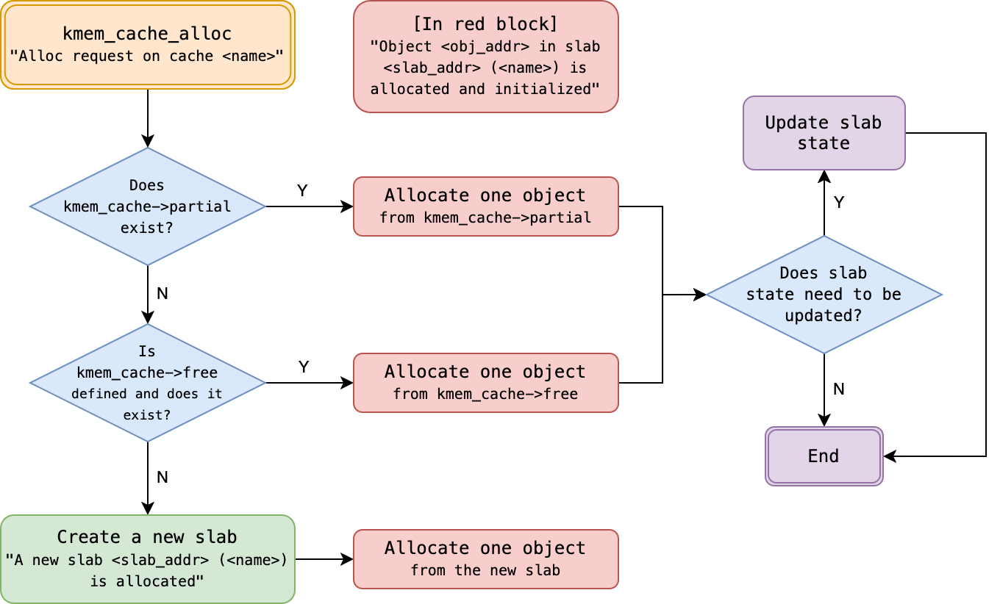
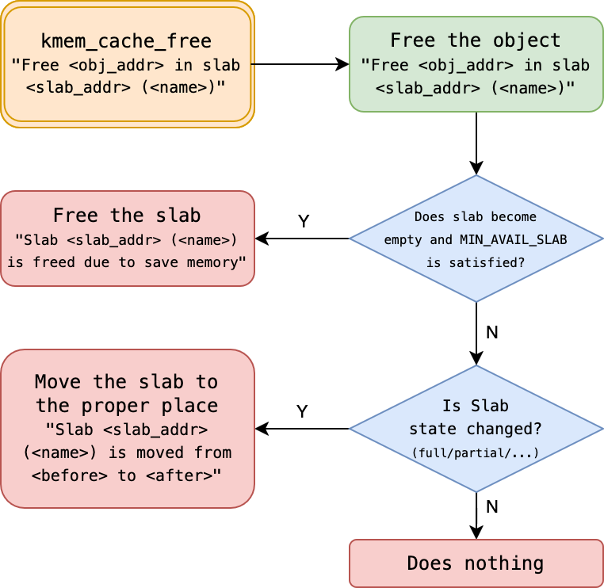

# MP2 Memory Management: Kernel Memory Allocation (Slab)

## Basic Information

* **Full Score**: 140%
* **Release Date**: March 18, 2025
* **Due Date**: April 1, 2025
* **TA Email**: ntuos@googlegroups.com
* **TA Hours**: Wednesday 1:00–2:00 p.m., Friday 11:00 a.m.–12:00 p.m., at B04

[TOC]


## Abstraction

In the MP2 assignment, we will explore **memory allocation and deallocation mechanisms for small kernel objects** and require students to **design and implement a SLAB allocator** within the `xv6` operating system.

Key focuses of this assignment include:
- **Design of the SLAB allocator’s data structures**
- **Optimization of time and space efficiency for small object allocation**
- **Various optimization techniques related to SLAB**

Through this assignment, students will gain hands-on experience in **designing and implementing system memory management** and learn how to enhance the efficiency of kernel memory allocation.

## Environment Setup and Preparation

Please ensure the following steps are completed to set up your development environment:

1. Verify that [Git](https://git-scm.com/) is installed.
2. Ensure you have a [GitHub account](https://github.com/). If not, please register one.
3. Access the MP2-specific [GitHub Classroom link]() and click **Accept this assignment**. The system will create a dedicated repository for you: `mp2-<USERNAME>`.
4. Access your MP2 repository at `https://github.com/ntuos2025/mp2-<USERNAME>`.
5. Clone the repository locally:
    ```bash
    git clone https://github.com/ntuos2025/mp2-<USERNAME>
    ```
6. Fill in your student ID in the `student_id.txt` file within the repository, e.g.:
    ```log
    b12345678
    ```
7. Run `mp2.sh` to prepare the **`ntuos/mp2` container**:
    ```bash
    ./mp2.sh start
    ```
8. **(Optional) Set up VS Code development environment inside the container:**
    - Install the [Docker](https://marketplace.visualstudio.com/items?itemName=ms-azuretools.vscode-docker) and [Dev Containers](https://marketplace.visualstudio.com/items?itemName=ms-vscode-remote.remote-containers) extensions.
    - Open VS Code, go to the **Docker sidebar**, and locate `ntuos/mp2`.
    - Right-click and select **Attach Visual Studio Code**.
    - Choose `ntuos/mp2`. VS Code will open a new development environment, allowing direct development within the container.
9. Test whether the environment is functioning correctly:
    ```bash
    ./mp2.sh test
    ```

## Grading Criteria and Submission Method

### Grading Criteria

The total score for this assignment is **140%**, comprising **basic requirements and bonus items**. It is recommended that students **complete the basic implementation first before attempting the bonus items**.

#### Basic Requirements

- **Debugging Tools (10%)**
  - [`sys_printfslab`](#implementing-system-call-sys_printfslab) system call (5%)
  - [`print_kmem_cache`](#print_kmem_cache-printing-struct-kmem_cache-information) (5%)
- **[SLAB Design](#struct-slab-design) (5%)**
- **Functionality Tests (Public Tests) (45%)**
  - [`kmem_cache_create`](#kmem_cache_create-creating-kmem_cache) (5%)
  - [`kmem_cache_alloc`](#kmem_cache_alloc-allocating-objects) (20%)
  - [`kmem_cache_alloc`](#kmem_cache_alloc-allocating-objects) + [`kmem_cache_free`](#kmem_cache_free-freeing-objects) (20%)
- **Hidden Tests (Private Tests) (40%)**

#### Bonus Items

Bonus items do not conflict with the basic requirements and are independent of each other, allowing students to implement multiple items.

- **Security Enhancements (Up to +16%)**
  - [`freelist` Pointer Obfuscation](#1-freelist-pointer-obfuscation) (+8%)
  - [`freelist` Randomization](#2-freelist-randomization) (+8%)
- **SLAB Optimization (Up to +24%)**
  - [`struct slab` Memory Optimization](#struct-slab-design) (+6%)
  - [`kmem_cache` Internal Fragmentation Optimization](#kmem_cache-internal-fragmentation-bonus-item) (+8%)
  - [Managing SLAB with `kernel/list.h`](#struct-slab-design) (+10%)

### Submission and Grading Method

All code must be submitted via **GitHub Classroom** using Git. Ensure your final submission complies with the requirements.

You may submit unlimited times before the deadline. The assignment will be automatically graded using a prepared GitHub Action, which will check submission history and test results to determine the final score.

The final score will include both functionality tests and hidden tests. You can view the results by checking the GitHub Action runs in your MP2 repository.

## Problem Background: Challenges in Kernel Memory Management

Imagine the kernel needs to allocate 100 system objects of size `40B`, such as `struct file` in xv6. If each object is stored in a separate page, not only does this incur the overhead of page allocation, but it also leads to severe internal fragmentation, especially for small system objects.

By leveraging the fact that these system objects are of the same size, the kernel could pre-allocate one or more contiguous pages and divide their internal space into `40B` units. This approach maximizes page space utilization, reduces internal fragmentation, and speeds up allocation by reusing existing pages rather than allocating new ones, especially given the likelihood of repeated access to the same page in a short time.

> 
> Review the course slides.

The Slab system, originating from SunOS source code, was used in early Linux kernels to manage memory allocation for small system objects. This assignment will guide students in **designing and implementing a new Slab memory allocation system** to improve memory management efficiency for small objects.

On a side note, the lab where the MP2 TAs work is called NEWSLAB, which can be playfully split as "New Slab"—fittingly, the goal of MP2! Hopefully, this isn’t too cheesy.

## Preliminary Design and API of the Slab Allocator

### Preliminary Design of the Slab Allocator

The goals of the Slab allocator design are:

1. Allocate pages for kernel objects of the same size.
2. Divide pages into fixed-size objects to improve memory utilization efficiency.

To simplify the design, **assume the kernel can only allocate a single page at a time**, not multiple contiguous pages. Based on this assumption, we define `struct slab`, which is the size of a single page and includes the object category name `name`, the size of each object `object_size`, and a `freelist` to manage available objects.

```c
struct slab {
    char name[MP2_CACHE_MAX_NAME];
    uint object_size;
    void **freelist;
    ...
};
```

In C, `void *` represents a pointer to any type but cannot be dereferenced directly due to its unspecified type, requiring a cast to a specific type for operations. `(void *) *freelist` denotes an array of `void *` pointers or a pointer to a `void *`. The detailed structure of `freelist` will be elaborated in [a later section](#freelist-data-structure).

Since `name` and `object_size` are identical for objects of the same type, we can design an additional structure, `struct kmem_cache`, above `struct slab` to manage shared information for objects of the same type, reducing the memory overhead of `struct slab`.

```c
struct slab {
    void **freelist;
    ... // Additional members can be added as needed
};

struct kmem_cache {
    char name[MP2_CACHE_MAX_NAME];
    uint object_size;
    struct slab *slab; // Tracks the currently used slab
    ... // Additional members can be added as needed
};
```

We expect these structures to provide the following four core functions:

```c
// Initialize a slab allocator to manage system objects named "name" with size "object_size"
struct kmem_cache *kmem_cache_create(char *name, uint object_size);

// Allocate a system object and return it
void *kmem_cache_alloc(struct kmem_cache *cache);

// Free a previously allocated system object "obj"
void kmem_cache_free(struct kmem_cache *cache, void *obj);

// Destroy the kmem_cache (not included in grading)
void kmem_cache_destroy(struct kmem_cache *cache);
```

Using these APIs, other kernel developers can manage memory as follows:

```c
// Initialize a slab allocator for struct file
struct kmem_cache *file_cache = kmem_cache_create("file", sizeof(struct file));

// Allocate a struct file object
struct file *file_allocated = (struct file *) kmem_cache_alloc(file_cache);

// Free a struct file object
kmem_cache_free(file_cache, file2release);

// Destroy the file_cache when no longer needed
kmem_cache_destroy(file_cache);
```

This is the interface design of the Slab allocator in the MP2 assignment and the core objective of this implementation. In the following sections, we will delve into its specific implementation details.

### API Interface

This assignment requires providing the following Slab APIs for use in the `xv6` kernel:

#### 1. `kmem_cache_create`

```c
struct kmem_cache *kmem_cache_create(const char *name, size_t size);
```
- **Function**: Initialize a `kmem_cache` to manage objects of a specific size.
- **Parameters**:
  - `name`: Cache name (for debugging and management).
  - `size`: Object size (memory requirement of a single object).
- **Return Value**: Pointer to the newly created `kmem_cache`.

#### 2. `kmem_cache_alloc`

```c
void *kmem_cache_alloc(struct kmem_cache *cache);
```
- **Function**: Obtain an available object from the `kmem_cache`.
- **Parameters**:
  - `cache`: Pointer to the `kmem_cache` structure.
- **Return Value**: Pointer to the allocated object on success; `NULL` on failure.

#### 3. `kmem_cache_free`

```c
void kmem_cache_free(struct kmem_cache *cache, void *obj);
```
- **Function**: Return an object to the `kmem_cache` for future allocation.
- **Parameters**:
  - `cache`: Pointer to the `kmem_cache` structure.
  - `obj`: Pointer to the object to be freed.

## Considerations for Implementing the Slab Allocator

### `freelist` Data Structure

After reading the above, you may be eager to implement the SLAB memory allocation mechanism in `xv6`. However, a key challenge in this process is **how to design the `freelist` data structure**.

First, `freelist` is essentially a contiguous memory region, i.e., **an array**. For any array, the time complexity of retrieving or releasing an element is typically $O(n)$, where $n$ is the maximum number of objects that can be stored in `freelist`. However, in a performance-critical Linux kernel, such high complexity is unacceptable. Thus, we need a **more suitable data structure** to optimize allocation and deallocation times.

### Application of Linked Lists

Readers familiar with data structures know that a **linked list** allows element removal and insertion in $O(1)$ time, making it ideal for implementing object allocation and deallocation—hence the name `freelist`. We can treat `freelist` as a linked list of unallocated objects and operate as follows:

- **Allocate an object**: Remove the first available object from `freelist` and update the `freelist` pointer.
- **Free an object**: Insert the freed object back into `freelist`.

This reduces the time complexity of both allocation and deallocation to **$O(1)$**, significantly improving performance.

### How to Create a Linked List in Contiguous Memory?

An intuitive approach is to **create an additional linked list to track available memory addresses in the array**. Suppose the original object array is `objects`, and `freelist` stores the addresses of available objects:

```c
struct slab {
    void **objects;
    void **freelist; // Linked list, initially recording addresses of all available objects
};
```

However, this design has two issues:

1. It requires extra memory to store the linked list nodes of `freelist`.
2. The memory allocation and management of `freelist` itself remain unresolved.

To address this, Linux kernel developers often use a C language technique of **interpreting memory differently**, directly using unallocated memory to store linked list pointers, maximizing the use of allocated memory. Specifically, **each unused object can store a pointer to the next available object**, forming a linked list. This concept is similar to the previous design but resolves both issues simultaneously.

Assuming the size of system objects is **at least as large as a pointer**, we can safely treat **unallocated objects as linked list nodes**. Here’s an example of `freelist` operation:

```c
struct slab {
    void **freelist;
    ...
};

struct slab *s = ...;
// Get the first available object
void *free_obj = s->freelist;
// The first pointer-sized space in `free_obj` stores the address of the next available object
void *next_free_obj = *(void **)free_obj;
// Reinterpret the memory as a specific system object (e.g., struct file)
struct file *f = (struct file *) free_obj;
struct file *f_next = (struct file *) next_free_obj;
```

Too many `void *` pointers confusing you? The `xv6` implementation in [`kernel/kalloc.c`](../kernel/kalloc.c) offers a more readable approach:

```c
// in kalloc.c
// struct run interprets a memory block as a structure with a next member
struct run {
    struct run *next;
};

struct {
    struct spinlock lock;
    struct run *freelist;
} kmem;
```

This allows the earlier example to be rewritten equivalently as:

```c
struct slab {
    struct run *freelist;
    ...
};

struct slab *s = ...;
// Get the pointer to the first available object
struct run *r = s->freelist;
// The `next` member in the first available object contains the address of the next available object
struct run *r_next = r->next;
// Reinterpret the memory as a specific system object (e.g., struct file)
struct file *f = (struct file *) r;
struct file *f_after_f = (struct file *) r_next;
```

Students may also place two pointers within a kernel object’s space to implement a doubly linked list. Please design an appropriate data structure for `freelist` based on the [Slab allocator implementation requirements](#slab-allocator-implementation-requirements).

### Number of Elements in `freelist`

For a slab occupying one page, the number of elements in `freelist` should be:

$$
\frac{\text{Page size - Metadata size in a slab}}{\text{Size of each object}}
$$

### `kmem_cache` Data Structure

`kmem_cache` is the core structure in the Slab allocator responsible for managing memory allocation for objects of the same type. Its initial form is:

```c
struct slab {
    <ptr> freelist;
    ... // Other fields can be extended as needed
};

struct kmem_cache {
    char name[MP2_CACHE_MAX_NAME];
    uint object_size;
    struct slab *slab; // Points to the currently used struct slab
    ... // Other fields can be extended as needed
};
```

Key considerations in system design include:

- The size of `struct kmem_cache` (and `struct slab`) is fixed at one page and cannot be dynamically adjusted.
- To improve memory allocation efficiency, `struct kmem_cache` should point to a list of Slabs with available space. Common Slab list categories are:
  - **Full**: All objects are allocated.
  - **Partial**: Some objects remain available.
  - **Free**: Unused Slabs.
- **When all existing Slabs are full, a new page should be allocated to create an additional Slab**. Thus, while each `kmem_cache` corresponds to a single object type, the number of Slabs it manages may vary dynamically with memory demand.

Since `kmem_cache` may need to manage a large number of Slabs dynamically, designing `kmem_cache::slab` as an array is impractical. A **linked list** is more suitable. The design can be refined as:

```c
struct slab {
    <ptr> freelist;

    {   // Slab list linkage pointers
        <ptr> <next>;
        <ptr> <prev>; // Optional, depending on situational needs
    }
    ... // Other fields can be extended as needed
};

struct kmem_cache {
    char name[MP2_CACHE_MAX_NAME];
    uint object_size;

    <ptr> full;    // Points to the list of full Slabs
    <ptr> partial; // Points to the list of partially used Slabs
    <ptr> free;    // Points to the list of free Slabs

    ... // Other fields can be extended as needed
};
```

Here, `<ptr>` can be `struct slab *`, `void *`, or `struct list_head`, the latter being a Linux-style doubly linked list management approach provided in [`kernel/list.h`](../kernel/list.h). For usage details, refer to the documentation comments in that file. Students implementing Slab lists with `struct list_head` from this library will have a bonus opportunity.

### Synchronization and Race Conditions in `kmem_cache`

In multi-core and multi-threaded environments, operations on `kmem_cache` involve modifying and managing Slab lists, potentially leading to race conditions. When multiple CPUs access `kmem_cache` simultaneously—especially during object allocation (`kmem_cache_alloc()`) or deallocation (`kmem_cache_free()`)—data inconsistency or memory corruption may occur without proper synchronization.

To ensure thread safety in `kmem_cache`, appropriate synchronization mechanisms should be employed to protect critical sections. Common solutions include:

- **Spinlock**: Suitable for short-duration locking to avoid process-switching overhead.
- **Mutex**: For longer operations, reducing busy-waiting impact.
- **Per-CPU Cache**: Using a per-CPU `kmem_cache_cpu` to minimize cross-CPU lock contention, synchronizing globally only when necessary. This is a key optimization in the modern Linux kernel’s SLUB allocator, the successor to SLAB.

For this assignment, students need only use **spinlocks** to ensure `kmem_cache` thread safety. Below is an example of using `xv6`’s **spinlock** to ensure correctness in a multi-threaded environment:

```c
struct kmem_cache {
    ...
    struct spinlock lock;  // For synchronizing kmem_cache management
};

void some_func() {
    struct kmem_cache *cache = kmem_cache_create(...);

    // Enter critical section to prevent race conditions
    acquire(&cache->lock);
    
    // Critical operation that may cause contention
    cache->partial = NULL; 

    // Release lock, exit critical section
    release(&cache->lock);
}
```

When implementing Slab functionality and applying it to `file.c`, pay close attention to thread safety issues.

### Security Enhancements for `freelist` (Optional Bonus Items)

Currently, linked list nodes in `freelist` are typically arranged in memory address order, making allocation and deallocation predictable and potentially exploitable by attackers. The Linux kernel introduces two techniques to enhance `freelist` security:

#### (1) `freelist` Pointer Obfuscation

By XOR-ing `freelist` pointers, attackers cannot directly read or predict available object addresses. The Linux kernel uses the following formula for pointer obfuscation:

```c
ptr = ptr ^ kmem_cache->random ^ swab(ptr_addr);
```

The XOR operation combines the original pointer (to the next free object) with two values: a random number set during `kmem_cache` initialization and the memory address storing the pointer (`ptr_addr`) after a byte-order swap (`swab`, see [`uapi/linux/swab.h`](https://github.com/torvalds/linux/blob/master/include/uapi/linux/swab.h) and [`linux/swab.h`](https://github.com/torvalds/linux/blob/master/include/linux/swab.h)). If a vulnerability allows an attacker to overwrite `ptr`, successful exploitation requires knowing both the random number and `ptr_addr`, increasing the attack difficulty.

In this assignment, implementing pointer obfuscation offers a bonus opportunity. When `MP2_FREELIST_HARDENED = 1` is defined in [`param.h`](../kernel/param.h):

- `kmem_cache` will include a random number `random` for XOR operations.
- `freelist` pointers must be decoded and encoded during access.

#### (2) `freelist` Randomization

During SLAB initialization, randomly arrange available objects in `freelist` to break memory address predictability, enhancing security.

When `MP2_FREELIST_RANDOMIZATION = 1` is defined in [`param.h`](../kernel/param.h):

- The initialization order of `freelist` will be generated by a pseudo-random number generator.
- Please implement the pseudo-random number generator yourself; it is recommended to implement it in [`kernel/random.h`](../kernel/random.h) as an extension of the xv6 kernel functionality, which may be provided to other kernel developers in the future.
- The initialization order of the `freelist` for each `slab` will be different, increasing the difficulty of attacks.
- We will check the distribution of the initialization starting values.

### `kmem_cache` Internal Fragmentation Issue (Bonus Item)

`struct kmem_cache` itself is a **dynamically allocated system object**, typically occupying **a full page**, but its own size is much smaller, leading to memory waste. To address this, the remaining space can be used to store allocatable objects within the Slab.

To comply with [implementation specifications](#print_kmem_cache-printing-struct-kmem_cache-information), treat `struct kmem_cache` as a slab with `<slab_type>` as `cache`. In printed information, `<slab_addr>` directly corresponds to `struct kmem_cache`’s memory address.

## Implementation Requirements

This assignment offers students significant flexibility to customize the `slab` design, provided the following specifications are followed.

### File Modification Rules

* **Ensure your student ID is filled in the `student_id.txt` file**.
* Modification of the following restricted files is prohibited:
  * Restricted Git branch: `ntuos/mp2-submit`
  * Restricted files:
    - `kernel/file.h`
    - `kernel/list.h`
    - All code in the `user/` directory
  * If restricted files in the `ntuos/mp2-submit` branch show modification records, it will be considered a violation, resulting in a score of zero.
  * Modifications are allowed in other Git branches.
  * Local changes to these files are permitted but must not be committed to the restricted branch.
* `kernel/param.h` file:
  * Students **may only modify** `MP2_FREELIST_HARDENED` and `MP2_FREELIST_RANDOMIZATION`.
  * No other code adjustments are allowed.
* `kernel/file.c` file:
  * Students **must not modify** print-related code prefixed with `[FILE] `.
  * Adjust the remaining code to use `struct kmem_cache` to manage `struct file`.
* Students are free to add new files and modify other code.

### `struct slab` Design

Design the `struct slab` data structure. Since kernel developers typically aim to maximize memory utilization, students are encouraged to minimize `struct slab`’s memory footprint to enhance space efficiency.

```c
struct slab {
    <ptr> freelist;

    {
        <ptr> <next>;
        <ptr> <prev>;
    }
    ... // Students may extend as needed
};
```

The `struct slab` design will be graded based on three criteria:

1. **`struct slab` Memory Size** (Up to 9%)
   Define the size factor $v(s)$ as:
   $$
   v(s) = \frac{\text{sizeof(struct slab)}}{\text{sizeof(void *)}}
   $$
   Grading scale:

   | `v(s)` | Score |
   |--------|-------|
   | $\le$ 3 | 3% + 6% |
   | 4      | 3% + 2% |
   | 5      | 3%      |
   | 6      | 2%      |
   | 7      | 1%      |
   | $\ge$ 8 | 0%      |

2. **Number of Objects Accommodated in `slab::freelist`** (2%)
   During testing, `struct file` is 504 bytes. Grading scale:

   | Number of `struct file` Objects | Score |
   |---------------------------------|-------|
   | 8                              | 2%    |
   | 7                              | 1%    |
   | $\le$ 6                        | 0%    |

3. **Using `struct list_head` for Slab Management** (Bonus +10%)
   - Must use [`struct list_head`](../kernel/list.h) in `struct slab` to maintain inter-Slab linkage.
   - Full marks (45%) in functionality tests are required to earn this additional 10%.

### `struct kmem_cache` Design

```c
struct kmem_cache {
    char name[MP2_CACHE_MAX_NAME];
    uint object_size;
    struct spinlock lock;

    <ptr> full;    // Full (optional)
    <ptr> partial; // Partially used
    <ptr> free;    // Free (optional)

    ... // Students may extend as needed
};
```

Key considerations:

1. **Free Slab Release Mechanism**
   To reduce memory waste from excessive free Slabs, when the total number of available Slabs (`partial + free`) exceeds `MIN_AVAIL_SLAB` defined in [`param.h`](../kernel/param.h), and a new Slab becomes fully free (`free`), its memory should be actively released. This will be tested via `kmem_cache_free`.

2. **Internal Fragmentation Optimization**
   Due to [internal fragmentation issues](#kmem_cache-internal-fragmentation-issue), allocating and freeing objects using `kmem_cache`’s internal space (setting their `<slab_addr>` to `kmem_cache`’s address) earns an additional **7%**.

3. **Optionality of `full` and `free`**
   `full` and `free` in `kmem_cache` are optional. Students may refer to [Linux Kernel SLUB design](https://github.com/torvalds/linux/blob/0fed89a961ea851945d23cc35beb59d6e56c0964/mm/slub.c#L154) or adopt other suitable methods, provided they meet [implementation specifications](#print_kmem_cache-printing-struct-kmem_cache-information).

### Slab Functionality

Implement the following functions in [`slab.c`](./kernel/slab.c):

```c
// 1. Core Slab Memory Management Functions
// 1-1. Initialize a Slab allocator, creating a kmem_cache for system objects named "name" with size "object_size"
struct kmem_cache *kmem_cache_create(char *name, uint object_size);
// 1-2. Allocate a system object and return its memory address
void *kmem_cache_alloc(struct kmem_cache *cache);
// 1-3. Free the specified system object "obj"
void kmem_cache_free(struct kmem_cache *cache, void *obj);
// 1-4. Destroy the kmem_cache
void kmem_cache_destroy(struct kmem_cache *cache);

// 2. Debugging Function
void print_kmem_cache(struct kmem_cache *, void (*)(void *));
```

All Slab memory management functions should use `[SLAB] ` as a prefix for output messages, e.g.:

```log
[SLAB] Alloc request on cache file
```

### `kmem_cache_create`: Creating `kmem_cache`

Before successfully creating and returning `kmem_cache`, output the following:

```log
[SLAB] New kmem_cache (name: <name>, object size: <obj_size> bytes) is created
```

- **`<name>`**: Name of the new `kmem_cache` (`kmem_cache::name`).
- **`<obj_size>`**: Size of objects within the `kmem_cache` (`kmem_cache::object_size`, in bytes).

### `kmem_cache_alloc`: Allocating Objects

When allocating objects, follow the flowchart below and output corresponding information. Replace variables in **angle brackets (`<>`)** with actual values, ensuring each line is prefixed with `[SLAB] ` and words are separated by a single space.



- **`<name>`**: Name of the `kmem_cache` (`kmem_cache::name`).
- **`<slab_addr>`**: Memory address of the Slab containing the object.
- **`<obj_addr>`**: Memory address of the allocated object.

In addition, students can also print other customized debug messages, as long as they do not conflict with the print format in the flowchart. As suggestion, one can print custom debug messages with other prefixes (such as lowercase `[slab]`, etc.).

### `kmem_cache_free`: Freeing Objects

When freeing objects, follow the flowchart below and output corresponding information. Ensure output complies with specifications, replacing variables in **angle brackets (`<>`)**, with all messages prefixed with `[SLAB] ` and words separated by a single space.



- **`<name>`**: Name of the `kmem_cache` (`kmem_cache::name`).
- **`<slab_addr>`**: Memory address of the Slab containing the object.
- **`<obj_addr>`**: Memory address of the object to be freed.
- **`<before>`**: State of the object’s Slab before freeing (`full/partial/free/cache`).
- **`<after>`**: State of the object’s Slab after freeing (`full/partial/free/cache`).

Additionally, if **the number of (`partial` + `free`) Slabs exceeds `MIN_AVAIL_SLAB`** and the object’s Slab becomes fully free (`free`), release the Slab to reclaim memory.

In addition, students can also print other customized debug messages, as long as they do not conflict with the print format in the flowchart. As suggestion, one can print custom debug messages with other prefixes (such as lowercase `[slab]`, etc.).

### Applying the Slab Allocator to `struct file` Management

In xv6, `struct file` was originally managed by `ftable` in `file.c`. Replace it with `struct kmem_cache *file_cache` and adjust `file.c` accordingly.

The following code has been added to `file.[h,c]` for you:

```c
// file.h
#include "kernel/param.h"
#include "kernel/slab.h"

struct file {
  ...
#ifdef MP2_TEST
  int fat_element[MP2_FILE_MAGIC_N];
#endif // _MP2_TEST_
};

extern struct kmem_cache *file_cache;
// Print file object metadata
void fileprint_metadata(void *f);

// file.c
void fileprint_metadata(void *f) {
  struct file *file = (struct file *) f;
  printf("tp: %d, ref: %d, readable: %d, writable: %d, pipe: %p, ip: %p, off: %d, major: %d",
         file->type, file->ref, file->readable, file->writable, file->pipe, file->ip, file->off, file->major);
}

struct kmem_cache *file_cache;

void
fileinit(void)
{
  printf("[FILE] fileinit\n");
  // ...
}

// Allocate a file structure.
struct file*
filealloc(void)
{
  printf("[FILE] filealloc\n");
  // ...
}

// ...

void
fileclose(struct file *f)
{
  // ...
  printf("[FILE] fileclose\n");
  ff = *f;
  f->ref = 0;
  // ...
}
```

Note: **Do not modify** the **print-related code** added to `file.c`. Debugging messages prefixed with `[FILE] ` should be output in `fileinit`, `filealloc`, and `fileclose` (when `ref` drops to 0).

### `print_kmem_cache`: Printing `struct kmem_cache` Information

When printing `struct kmem_cache`, classify `struct slab` based on the remaining allocation count as `<slab_type>` (e.g., `full`, `partial`), using the following format:

```log
[SLAB] kmem_cache { name: <name>, obj_size: <object_size>, harden: <harden>, rand: <rand> }
[SLAB] <SPACE>[ <slab_type> slabs (head: <slab_addr>) ]
...
[SLAB] <SPACE>[ <slab_type> slabs (head: <slab_addr>) ]
...
```

Additionally, print information for all `struct slab` instances managed by the system, with each `struct slab` including:

```log
[SLAB] <SPACE>[ slab <slab_addr> ] { freelist: <freelist>, next: <next_slab_addr> }
[SLAB] <SPACE>{ addr: <entry_addr>, as_ptr: <as_ptr>, as_obj: { <as_obj> } }
[SLAB] <SPACE>{ addr: <entry_addr>, as_ptr: <as_ptr>, as_obj: { <as_obj> } }
...
[SLAB] <SPACE>{ addr: <entry_addr>, as_ptr: <as_ptr>, as_obj: { <as_obj> } }
```

Field definitions:

- `<name>`: Name of the `kmem_cache` (`kmem_cache::name`).
- `<obj_size>`: Size of objects in the `kmem_cache` (`kmem_cache::object_size`).
- `<SPACE>`: Any number of spaces or tabs (`\t`).
- `<slab_type>`: Classified as `full`, `partial`, `free`, or [`cache`](#kmem_cache-internal-fragmentation-issue).
  - All types may be printed during debugging.
  - ***Only `partial` and `cache` (if implemented) are checked in actual tests.***
  - The full and free slabs can be tracked through inference, so there is no need to print them.
- `<slab_addr>`: Memory address of the slab.
- `<harden>`: Value of `MP2_FREELIST_HARDENED` (`0` or `1`), see [`freelist` security enhancements](#freelist-security-enhancements).
- `<rand>`: Value of `MP2_FREELIST_RANDOMIZATION` (`0` or `1`), see [`freelist` security enhancements](#freelist-security-enhancements).
- `<freelist>`: Value of `slab::freelist`.
- `<entry_addr>`: Memory address of each object in `slab::freelist`, printed in ascending order, equivalent to its entry in the freelist.
- `<as_ptr>`: Result of interpreting the entry as a pointer.
- `<as_obj>`: Result of interpreting the entry as a system object, i.e., the output of passing the object to `slab_obj_printer`.

Example:

<pre style="border: 1px solid #e8e8e8;padding: 10px;border-radius: 4px;font-size: 5.5px;line-height: 1.5;overflow-x: auto;white-space: pre-wrap;"><code>[SLAB] kmem_cache { name: file, object_size: 504, harden: 0, rand: 1 }
[SLAB]    [ Full    slabs (head: 0x0000000087f59058) ]
[SLAB]    [ Partial slabs (head: 0x0000000087f59040) ]
[SLAB]        [ slab 0x0000000087f4e000 ] { freelist: 0x0000000087f4ede8, prev: 0x0000000087f59040, next: 0x0000000087f32008 }
[SLAB]            { addr: 0x0000000087f4e020, as_ptr: 0x0000000900000003, as_obj: { tp: 3, ref: 9, readable: 1, writable: 1, pipe: 0x0000000000000000, ip: 0x0000000080035488, off: 0, major: 1 } }
[SLAB]            { addr: 0x0000000087f4e218, as_ptr: 0x0000000000000000, as_obj: { tp: 0, ref: 0, readable: 1, writable: 1, pipe: 0x0000000000000000, ip: 0x0000000080035598, off: 0, major: 0 } }
[SLAB]            { addr: 0x0000000087f4e410, as_ptr: 0x0000000087f4e218, as_obj: { tp: -2013994472, ref: 0, readable: 1, writable: 1, pipe: 0x0000000000000000, ip: 0x0000000080035620, off: 0, major: 0 } }
[SLAB]            { addr: 0x0000000087f4e608, as_ptr: 0x0000000087f4e410, as_obj: { tp: -2013993968, ref: 0, readable: 1, writable: 1, pipe: 0x0000000000000000, ip: 0x00000000800356a8, off: 0, major: 0 } }
[SLAB]            { addr: 0x0000000087f4e800, as_ptr: 0x0000000087f4e608, as_obj: { tp: -2013993464, ref: 0, readable: 1, writable: 1, pipe: 0x0000000000000000, ip: 0x0000000080035730, off: 0, major: 0 } }
[SLAB]            { addr: 0x0000000087f4e9f8, as_ptr: 0x0000000087f4e800, as_obj: { tp: -2013992960, ref: 0, readable: 1, writable: 1, pipe: 0x0000000000000000, ip: 0x00000000800357b8, off: 0, major: 0 } }
[SLAB]            { addr: 0x0000000087f4ebf0, as_ptr: 0x0000000087f4e9f8, as_obj: { tp: -2013992456, ref: 0, readable: 1, writable: 1, pipe: 0x0000000000000000, ip: 0x0000000080035840, off: 0, major: 0 } }
[SLAB]            { addr: 0x0000000087f4ede8, as_ptr: 0x0000000087f4ebf0, as_obj: { tp: -2013991952, ref: 0, readable: 1, writable: 1, pipe: 0x0000000000000000, ip: 0x00000000800358c8, off: 0, major: 0 } }
</code></pre>

Students may add extra information beyond the required fields, adjusting the order as desired, provided all mandatory information is included.

```log
[SLAB] kmem_cache { <KV_PAIRS> }
[SLAB] <SPACE>[ slab <slab_addr> ] { <KV_PAIRS> }
[SLAB] <SPACE>{ <KV_PAIRS> }
[SLAB] <SPACE>{ <KV_PAIRS> }
...
[SLAB] <SPACE>{ <KV_PAIRS> }
```

`<KV_PAIRS>` denotes an arbitrary number of key-value pairs, separated by `<SPACE>,<SPACE>`.

Example:

<pre style="border: 1px solid #e8e8e8;padding: 10px;border-radius: 4px;font-size: 4.7px;line-height: 1.5;overflow-x: auto;white-space: pre-wrap;">
[SLAB] kmem_cache { rand: 0, name: file, some_thing: meow, object_size: 504, another_thing: 123, harden: 1 }
[SLAB]    [ Full    slabs (head: 0x0000000087f59058) ]
[SLAB]    [ Partial slabs (head: 0x0000000087f59040) ]
[SLAB]        [ slab 0x0000000087f4e000 ] { whoami: meow, freelist: 0x0000000087f4ede8, prev: 0x0000000087f59040, next: 0x0000000087f32008 }
[SLAB]            { addr: 0x0000000087f4e020, as_ptr: 0x0000000900000003, whoami: meow, as_obj: { tp: 3, ref: 9, readable: 1, writable: 1, pipe: 0x0000000000000000, ip: 0x0000000080035488, off: 0, major: 1 } }
[SLAB]            { addr: 0x0000000087f4e218, as_ptr: 0x0000000000000000, as_obj: { tp: 0, ref: 0, readable: 1, writable: 1, pipe: 0x0000000000000000, ip: 0x0000000080035598, off: 0, major: 0 } }
[SLAB]            { addr: 0x0000000087f4e410, as_ptr: 0x0000000087f4e218, as_obj: { tp: -2013994472, ref: 0, readable: 1, writable: 1, pipe: 0x0000000000000000, ip: 0x0000000080035620, off: 0, major: 0 } }
[SLAB]            { addr: 0x0000000087f4e608, whoami: meow, as_ptr: 0x0000000087f4e410, as_obj: { tp: -2013993968, ref: 0, readable: 1, writable: 1, pipe: 0x0000000000000000, ip: 0x00000000800356a8, off: 0, major: 0 } }
[SLAB]            { addr: 0x0000000087f4e800, as_ptr: 0x0000000087f4e608, as_obj: { tp: -2013993464, ref: 0, readable: 1, writable: 1, pipe: 0x0000000000000000, ip: 0x0000000080035730, off: 0, major: 0 } }
[SLAB]            { addr: 0x0000000087f4e9f8, as_ptr: 0x0000000087f4e800, as_obj: { tp: -2013992960, ref: 0, readable: 1, writable: 1, pipe: 0x0000000000000000, ip: 0x00000000800357b8, off: 0, major: 0 } }
[SLAB]            { addr: 0x0000000087f4ebf0, as_ptr: 0x0000000087f4e9f8, as_obj: { tp: -2013992456, ref: 0, readable: 1, writable: 1, pipe: 0x0000000000000000, ip: 0x0000000080035840, off: 0, major: 0 }, whoami: meow }
[SLAB]            { 0: 0, addr: 0x0000000087f4ede8, as_ptr: 0x0000000087f4ebf0, 2: 2, as_obj: { tp: -2013991952, ref: 0, readable: 1, writable: 1, pipe: 0x0000000000000000, ip: 0x00000000800358c8, off: 0, major: 0 } }
</pre>

### Implementing System Call `sys_printfslab`

Implement `sys_printfslab` to print the Slab (`struct kmem_cache`) for `file` as a system call.

Ensure the following user program runs correctly:

```c
#include "kernel/types.h"
#include "user/user.h"

int main(int argc, char *argv[])
{
  printfslab();
}
```

This code earns points if it compiles successfully, regardless of whether it prints the correct Slab information. By default, it cannot yet compile.

## References

1. [`xv6: a simple, Unix-like teaching operating system`](https://pdos.csail.mit.edu/6.828/2023/xv6/book-riscv-rev3.pdf)
2. [`linux/mm/slab.h`](https://github.com/torvalds/linux/blob/master/mm/slab.h)
3. [`linux/mm/slub.c`](https://github.com/torvalds/linux/blob/master/mm/slub.c#L154)
4. [`sysprog21/lab0-c`](https://github.com/sysprog21/lab0-c/blob/master/list.h)
5. [`linux/include/linux/list.h`](https://github.com/torvalds/linux/blob/master/include/linux/list.h)
6. [`Slab Memory Allocator`](https://hackmd.io/5Fn8N3HeRkGIO7cZu7chIw?view#slab-%E8%A8%98%E6%86%B6%E9%AB%94%E9%85%8D%E7%BD%AE%E5%99%A8)
