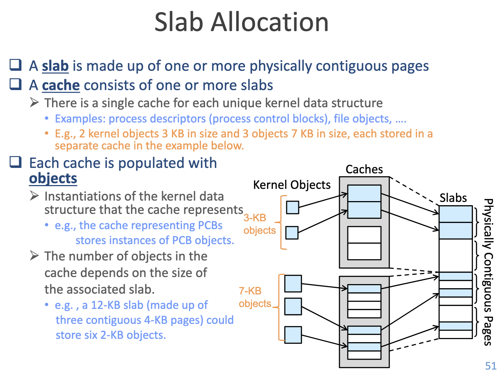

<div align="center">
  <h1>💻 Machine Problem 2 - Memory Management: Kernel Memory Allocator (Slab)</h1>
  <h3>CSIE3310 - Operating Systems</h3>
  <h4>National Taiwan University</h4>
</div>

<hr />

<div align="center">
  <table>
    <tr>
      <td><strong>Total Points:</strong></td>
      <td>100 + 30 (Bonus)</td>
      <td><strong>Release Date:</strong></td>
      <td>March 24</td>
    </tr>
    <tr>
      <td><strong>Due Date:</strong></td>
      <td>April 07, 23:59:59 (UTC+8)</td>
      <td><strong>Late Deadline:</strong></td>
      <td>April 11, 23:59:59 (UTC+8)</td>
    </tr>
    <tr>
      <td><strong>TA Hours:</strong></td>
      <td colspan="3">Wed. 13:30-14:30, Thr. 13:30-14:30 (@CSIE B04)</td>
    </tr>
  </table>
</div>

<hr />

## 📋 Table of Contents

- [💬 Discussion Policy](#-discussion-policy)
- [🎯 Assignment Overview](#-assignment-overview)
- [📈 Grading Policy](#-grading-policy)
  - [📌 Core Requirements (100%)](#-core-requirements-100)
  - [🌟 Bonus Challenges (30%)](#-bonus-challenges-30)
- [🧠 Technical Background](#-technical-background)
- [💡 Implementation Guide](#-implementation-guide)
  - [Initial Design of the Slab Allocator](#initial-design-of-the-slab-allocator)
  - [Contiguous Memory Model of `freelist`](#contiguous-memory-model-of-freelist)
  - [Layout and Relationships of System Components](#layout-and-relationships-of-system-components)
- [🛡️ Security Requirements](#️-security-requirements)
  - [Randomized Freelist (Bonus 10%)](#randomized-freelist-bonus-10)
  - [Spinlock Correctness (Bonus 10%)](#spinlock-correctness-bonus-10)
- [⚙️ Task Specifications](#️-task-specifications)
  - [Core APIs](#core-apis)
  - [System Integration Requirements](#system-integration-requirements)
  - [Output and Formatting Specifications](#output-and-formatting-specifications)

## 💬 Discussion Policy

If you have any questions regarding this assignment, please post them on the corresponding MP2 discussion board on NTU COOL. For personal questions and requests, please email [ntuos@googlegroups.com](mailto:ntuos@googlegroups.com).

## 🎯 Assignment Overview

In modern operating systems, the kernel frequently allocates and frees small objects (such as `struct file`). Directly requesting a full page for each object would lead to significant memory waste and performance overhead.

In this MP2 assignment, you will implement a **Slab Allocator** for the `xv6` operating system. This is a classic mechanism designed to address the challenges of small object allocation.

**Core Objectives:**

1. **Data Structure and Space Management**: Manage page memory with minimal overhead and reduce internal fragmentation.
2. **Modern Kernel Security**: Mitigate memory-based attacks—where an attacker predicts memory layouts—by implementing a dynamic randomization defense mechanism.

> [!NOTE]
> **Development Environment and Toolchain**:
> This assignment utilizes Docker containers and GitHub Actions for automated validation. Before starting, please carefully review:
>
> 1. [`doc/setup.md`](../doc/setup.md): Understand how to initialize the development environment, bind `student.conf` to your student ID, and protect your code.
> 2. [`doc/workflow.md`](../doc/workflow.md): Learn how to use `./mp.sh grade` to perform local testing and `git` code submission workflow.

## 📈 Grading Policy

### 📌 Core Requirements (100%)

- **Public Tests (80%)**
  - **Basic Slab Management (70%)**: Basic create, allocate, free, and `kmem_cache` lifecycle maintenance.
  - **Internal Fragmentation Optimization (Cache Optimization) (10%)**: Although `struct kmem_cache` has minimal metadata, it still requires a page. The remaining space of its Page should be properly utilized.
- **Private Tests (20%)**
  - Stress tests focusing on edge conditions and potential data race issues. System stability must be maintained.

> [!NOTE]
> **Late Submission Policy**
> Submissions after the Due Date (April 07) but before the Late Deadline (April 11) will incur a **20% daily deduction** based on your commit time. Submissions after the Late Deadline will not be accepted (0 points).

### 🌟 Bonus Challenges (30%)

The bonus points are calculated independently. You can choose to challenge the following items:

> [!WARNING]
> **Bonus Scoring Eligibility**
> Bonus points will only be calculated if your <font color=red>**Public Test score is $\ge 70$**</font>. If your public test score is below this threshold, all bonus points will be ignored (0 points awarded for bonus items).

- **Linux List API Application (+5%)**: Use the doubly linked list API provided by `kernel/list.h` to gracefully manage `slab`/`kmem_cache`.
- **Allocation Randomization (Randomized Freelist) (+10%)**:
  - **Structural Non-linearity (+5%)**: The `freelist` must not follow a simple monotonic memory address sequence.
  - **Entropy Verification (+5%)**: The shuffle quality will be statistically analyzed to ensure sufficient entropy.
- **Spinlock Correctness (+10%)**: Ensure your Spinlock implementation is robust. If all "Public Tests" pass 5 times out of 5, you will receive this bonus.
- **Ultimate Internal Fragmentation Optimization (Cache Optimization Bonus) (+5%)**: Push the number of `struct file` objects accommodated inside the `kmem_cache`'s own page to the absolute limit (see System Integration Requirements).

> [!NOTE]
> **Empirical Scoring (Repeat Testing Mechanism)**
> Since this MP2 involves partial development related to Spinlocks, it may produce Data Races or Deadlocks. For fairness and stability, each test case will run repeatedly for **5 times** during the official validation (each guaranteed to be a Clean Boot). Your score for a specific test will be determined as follows:
> - **Pass 1 or more times**: You receive full points for that test case.
> - **Pass 0 times**: You receive 0 points for that test case.
> Ensure that your Spinlock coverage is foolproof!

## 🧠 Technical Background

Consider a scenario where the kernel needs to allocate memory for 100 `struct file`s, each sized `40B`. Allocating a full 4KB page for each would not only involve high initialization overhead but also lead to severe **Internal Fragmentation**.

To maximize space utilization and allocation speed, the kernel can pre-allocate a full page and partition it into fixed-size `40B` chunks.

> 
>
> This is a classic mechanism originating from SunOS and later adopted by Linux to optimize small object allocation. Fun fact: The research lab that your MP2 TAs are part of is abbreviated as NEWSLAB, which can be interpreted as "NewSlab" — the very goal of this assignment! Well... hope that wasn't too cold of a joke.

## 💡 Implementation Guide

### Initial Design of the Slab Allocator

To simplify the problem, we stipulate that **the system can only request a single page from `kalloc()` at a time**. We need to define `struct slab` to manage the respective slices within a single page, and declare a `struct kmem_cache` to serve as the "chief manager" for slabs of the same type.

```c
struct slab {
    void **freelist; // Points to available space
    ... 
};

struct kmem_cache {
    char name[MP2_CACHE_MAX_NAME]; // e.g.: "file"
    uint object_size;              // e.g.: sizeof(struct file)
    <link> slab_head_1;            // <link> can be a pointer, linked list, etc. (Can freely choose the suitable approach to implement)
    ... 
};
```

### Contiguous Memory Model of `freelist`

After slicing up a full page, how do we keep track of "which spaces are empty"?

Linux developers utilized a type-casting technique: since these memory slots are currently "empty," we can **treat the first 8 bytes of each free slot as a pointer to the next available one**. This creates a zero-overhead linked list for the `freelist`.

```c
struct slab *s = ...;
// Get the first available free object
void *free_obj = s->freelist;
// The first 8 bytes of free_obj points to the next free slot
void *next_free_obj = *(void **)free_obj; 
// Once you are ready to allocate it to the user, cast it to the requested type
struct file *f = (struct file *) free_obj;
```

Alternatively, refer to the elegant design pattern already provided in `xv6`'s `kalloc.c`:

```c
// Treat memory as a struct with a next member
struct run {
    struct run *next;
};

struct slab {
    struct run *freelist;
    ...
};

// Access and step forward
struct run *r = s->freelist;
struct run *r_next = r->next;
struct file *f = (struct file *) r;
```

### Layout and Relationships of System Components

#### Responsibilities and Layout of `struct slab`

Each slab occupies a 4KB physical page. The page begins with `struct slab` metadata, with the remaining space partitioned into object blocks (linked via the `freelist`).
Depending on the number of available objects, a slab exists in one of three states: **full**, **partial**, or **free**.


> Illustration: State changes of a free slab before/after allocating one object.

Please precisely use **Pointer Arithmetic** to pinpoint the starting address of each space:


#### Link Management of `struct kmem_cache`

Depending on its remaining capacity, a slab acts in one of three states: **full**, **partial**, or **free**. The `kmem_cache` manages these slabs so that `alloc()` can quickly find a `partial/free` slab with available slots.


#### Concurrency and Synchronization

On a multi-core system, concurrent `alloc` or `free` calls may corrupt linked lists. Ensure you use the **spinlocks** provided by xv6 in critical sections:

```c
// Example 1
void *kmem_cache_api(struct kmem_cache *cache) {
    acquire(&cache->lock);
    if (...) {
        release(&cache->lock); // CRITICAL: Release before returning due to error
        return 0;
    }
    struct slab *s = ...;
    void *obj = s->freelist;
    // ... update freelist and links ...
    release(&cache->lock); // CRITICAL: Release before successful return
    return obj;
}

// Example 2
void fileclose(struct file *f) {
    acquire(&file_cache->lock);
    if (...) {
        // ...
        release(&file_cache->lock); // Release inside the branch
        return;
    }
    release(&file_cache->lock);
    // Finally, free the object back to the slab cache
    kmem_cache_free(file_cache, f);
}
```

## 🛡️ Security Requirements

Modern operating systems are vulnerable to speculative execution attacks (e.g., Heap Spraying). Attackers often assume the kernel allocates memory sequentially from low to high addresses, leading to a predictable memory layout.

### Randomized Freelist (Bonus 10%)

When you create a new Slab and initialize the `freelist` links between the partitioned chunks, the pointing order between objects **must not be linear**. Implement a shuffling algorithm (like Fisher-Yates Shuffle) to randomly shuffle the topology of the `freelist` slots at the exact moment of creation.

> [!IMPORTANT]
> **Randomization Validation Standards**
> The automated grading system will perform two types of sequence analysis:
> 1. **Structural Non-linearity (+5%)**: The `freelist` must not strictly follow an ascending or descending memory order (e.g., `[0,1,2,3...]` or `[N-1, N-2, ..., 0]`).
> 2. **Entropy Verification (+5%)**: The shuffle quality will be statistically analyzed (using inversion metrics). Even for small slabs ($N \approx 8$), your algorithm must demonstrate sufficient entropy to pass the threshold.

### Spinlock Correctness (Bonus 10%)

Since this assignment does not focus on locks and deadlocks, we want to reward students who handle concurrency correctly.

- **Requirement**: Achieve a 100% pass rate (5 out of 5 for every test case) across **ALL Public Tests**.
- **Challenge**: Ensure that any critical section is correctly protected by `acquire()` and `release()` of the appropriate spinlock, and that there are no race conditions or potential deadlocks in your implementation.
- **Validation**: If and only if all public test cases pass consistently 5 times in the official grading environment, this bonus will be awarded.

## ⚙️ Task Specifications

### Core APIs

You must implement the following exposed operations inside `kernel/slab.c`:

```c
// 1. Initialize an allocator pool for a specific object type
struct kmem_cache *kmem_cache_create(char *name, uint object_size);

// 2. Request and return a pointer to a free object
void *kmem_cache_alloc(struct kmem_cache *cache);

// 3. Free the object back to the allocator pool for subsequent reuse
void kmem_cache_free(struct kmem_cache *cache, void *obj);

// 4. Destroy and free the physical resources occupied by the entire allocator pool
// NOTE: This function won't be tested in this assignment
void kmem_cache_destroy(struct kmem_cache *cache);

// 5. Output internal states (for test framework verification)
void print_kmem_cache(struct kmem_cache *cache);
```

### System Integration Requirements

1. **Internal Fragmentation Optimization**: Utilize the remaining space within the single page obtained during `kmem_cache` allocation (aside from storing the `struct kmem_cache` itself) to allocate objects (e.g., `struct file`).
   - Grading Policy: You will receive scores corresponding to how many extra `struct file`s you can seamlessly cram into the `kmem_cache`'s page. Below is the reference scoring table:

     | Extra `struct file`s<br>allocatable in `kmem_cache` | 0 | 1~3 | 4~6 | 7 | 8<br>(bonus) |
     | :---: | :---: | :---: | :---: | :---: | :---: |
     | Score (10%)<br>with extra bonus (+5%) | 0 | 2 | 5 | 10 | 10 + 5 |

    - **Note**: It is possible to fit up to eight `struct file`s within the page containing the `struct kmem_cache`. The TAs will NOT provide hints regarding this implementation; please use your creativity to maximize memory utilization.
2. **System Integration**: In `kernel/file.c`, replace the static `ftable` array with your slab allocator. Call `file_cache = kmem_cache_create("file", ...)` during kernel boot to manage the lifecycle of all `struct file` objects. **The cache name must be exactly `"file"`**.

### Output and Formatting Specifications

All implemented functions must output formatted strings via `printf`. The grading scripts rely on parsing these outputs; **ensure that spaces are correct and the format matches exactly**:

#### `kmem_cache_create`

<pre style="border: 1px solid #e8e8e8;padding: 10px;border-radius: 4px;font-size: 10px;line-height: 1.5;overflow-x: auto;white-space: pre-wrap;"><code>[SLAB] New kmem_cache (name: &lt;name&gt;, object size: &lt;object_size&gt; bytes, at: &lt;kmem_cache_addr&gt;, max objects per slab: &lt;max_objs&gt;, support in cache obj: &lt;in_cache_obj&gt;) is created
</code></pre>

- **`<name>`**: The name of the newly created `kmem_cache` (`kmem_cache::name`).
- **`<object_size>`**: The size of the objects inside this `kmem_cache` in bytes (`kmem_cache::object_size`).
- **`<kmem_cache_addr>`**: The memory address of the `kmem_cache`.
- **`<max_objs>`**: The maximum number of objects that a single `slab` can accommodate.
- **`<in_cache_obj>`**: If "Internal Fragmentation Optimization" is implemented, this is the maximum number of objects that fit within the `kmem_cache` page; otherwise, print `0`.

#### `kmem_cache_alloc`


- **`<name>`**: The name of the `kmem_cache` (`kmem_cache::name`).
- **`<slab_addr>`**: The memory address of the slab to which the object belongs.
- **`<obj_addr>`**: The memory address of the allocated object.

##### Received Request

```txt
[SLAB] Alloc request on cache <name>
```

##### Create New Slab (If Necessary)

```txt
[SLAB] A new slab <slab_addr> (<name>) is allocated
```

##### Return Result

```txt
[SLAB] Object <obj_addr> in slab <slab_addr> (<name>) is allocated and initialized
```

#### `kmem_cache_free`


- **`<name>`**: The name of the `kmem_cache` (`kmem_cache::name`).
- **`<slab_addr>`**: The memory address of the slab to which the object belongs.
- **`<obj_addr>`**: The memory address of the object to be freed.

##### Before Freeing

```txt
[SLAB] Free <obj_addr> in slab <slab_addr> (<name>)
```

##### Memory Collection (Voluntarily returning memory back to the machine when [partial+free] > MP2_MIN_AVAIL_SLAB)

```txt
[SLAB] Slab <slab_addr> (<name>) is freed due to save memory
```

##### Completion

```txt
[SLAB] End of free
```

#### `print_kmem_cache` (Structured Validation Output)

This function allows the grading framework to map the memory topology and verify randomization metrics. The output is parsed strictly; please follow the format exactly, including spacing:

##### 1. Basic Info

```text
[SLAB] kmem_cache { name: <name>, object_size: <object_size>, at: <kmem_cache_addr>, in_cache_obj: <in_cache_obj> }
```

##### 2. Slab Link Status

```text
[SLAB] <SPACE>[ <slab_type><SPACE>slabs ]
```

- `<SPACE>`: At least one space `" "` or tab `"\t"`.
- `<slab_type>`: slab type, can be `full`, `partial`, `free`, or `cache`.

**Note: You only need to print slabs in the `partial` state (as well as the `cache` state for internal fragmentation optimization). Slabs in the `full` or `free` states are tracked dynamically by the grading engine through the allocation history and do not need to be output.**

##### 3. Single Slab Status

```text
[SLAB] <SPACE>[ slab <slab_addr> ] { freelist: <freelist>, nxt: <next_slab_addr> }
```

##### 4. Single Core Object Status

```text
[SLAB] <SPACE>[ idx <idx> ] { addr: <entry_addr>, as_ptr: <as_ptr>, as_obj: {<as_obj>} }
```

- `<idx>`: The index of the object within its respective slab.
- `<entry_addr>`: **Output object addresses in the order they appear in the `freelist`. The grading framework uses this sequence to evaluate randomization entropy.**
- `<as_ptr>`: The value of the first 8 bytes of the object when interpreted as a pointer (i.e., the `next` pointer in the `freelist`).
- `<as_obj>`: The object interpreted in its functional context. For `struct file`, pass the object address to the provided `fileprint_metadata` function to populate this field.

##### 5. Function Terminator Symbol

```txt
[SLAB] print_kmem_cache end
```

**6. Complete Output Example**

To assist with formatting consistency, below is a complete output example:

<pre style="border: 1px solid #e8e8e8;padding: 10px;border-radius: 4px;font-size: 5.2px;line-height: 1.5;overflow-x: auto;white-space: pre-wrap;"><code>[SLAB] kmem_cache { name: file, object_size: 504, at: 0x0000000087f59000, in_cache_obj: 0 }
[SLAB]    [ partial slabs ]
[SLAB]        [ slab 0x0000000087f4e000 ] { freelist: 0x0000000087f4e218, nxt: 0x0000000087f59040 }
[SLAB]           [ idx 0 ] { addr: 0x0000000087f4e020, as_ptr: 0x0000000900000003, as_obj: { tp: 3, ref: 9, readable: 1, writable: 1, pipe: 0x0000000000000000, ip: 0x00000000800354c8, off: 0, major: 1 } }
[SLAB]           [ idx 1 ] { addr: 0x0000000087f4e218, as_ptr: 0x0000000087f4e410, as_obj: { tp: -2013993968, ref: 0, readable: 1, writable: 0, pipe: 0x0000000000000000, ip: 0x0000000080035440, off: 1024, major: 0 } }
[SLAB]           [ idx 2 ] { addr: 0x0000000087f4e410, as_ptr: 0x0000000087f4e608, as_obj: { tp: -2013993464, ref: 0, readable: 1, writable: 0, pipe: 0x0000000000000000, ip: 0x00000000800354c8, off: 0, major: 1 } }
[SLAB]           [ idx 3 ] { addr: 0x0000000087f4e608, as_ptr: 0x0000000087f4e800, as_obj: { tp: -2013992960, ref: 0, readable: 5, writable: 5, pipe: 0x0505050505050505, ip: 0x0505050505050505, off: 84215045, major: 1285 } }
[SLAB]           [ idx 4 ] { addr: 0x0000000087f4e800, as_ptr: 0x0000000087f4e9f8, as_obj: { tp: -2013992456, ref: 0, readable: 5, writable: 5, pipe: 0x0505050505050505, ip: 0x0505050505050505, off: 84215045, major: 1285 } }
[SLAB]           [ idx 5 ] { addr: 0x0000000087f4e9f8, as_ptr: 0x0000000087f4ebf0, as_obj: { tp: -2013991952, ref: 0, readable: 5, writable: 5, pipe: 0x0505050505050505, ip: 0x0505050505050505, off: 84215045, major: 1285 } }
[SLAB]           [ idx 6 ] { addr: 0x0000000087f4ebf0, as_ptr: 0x0000000087f4ede8, as_obj: { tp: -2013991448, ref: 0, readable: 5, writable: 5, pipe: 0x0505050505050505, ip: 0x0505050505050505, off: 84215045, major: 1285 } }
[SLAB]           [ idx 7 ] { addr: 0x0000000087f4ede8, as_ptr: 0x0000000000000000, as_obj: { tp: 0, ref: 0, readable: 5, writable: 5, pipe: 0x0505050505050505, ip: 0x0505050505050505, off: 84215045, major: 1285 } }
[SLAB] print_kmem_cache end
</code></pre>

<pre style="border: 1px solid #e8e8e8;padding: 10px;border-radius: 4px;font-size: 5.2px;line-height: 1.5;overflow-x: auto;white-space: pre-wrap;"><code>[SLAB] kmem_cache { name: file, object_size: 504, at: 0x0000000087f59000, in_cache_obj: 0 }
[SLAB]    [ partial slabs ]
[SLAB]        [ slab 0x0000000087e5d000 ] { freelist: 0x0000000087e5d020, nxt: 0x0000000087f4e008 }
[SLAB]           [ idx 0 ] { addr: 0x0000000087e5d020, as_ptr: 0x0000000087e5d410, as_obj: { tp: -2014981104, ref: 0, readable: 1, writable: 0, pipe: 0x0000000000000000, ip: 0x0000000080035440, off: 1024, major: 0 } }
[SLAB]           [ idx 1 ] { addr: 0x0000000087e5d218, as_ptr: 0x0000000000000000, as_obj: { tp: 0, ref: 0, readable: 0, writable: 1, pipe: 0x0000000087e5c000, ip: 0x0000000000000000, off: 0, major: 0 } }
[SLAB]           [ idx 2 ] { addr: 0x0000000087e5d410, as_ptr: 0x0000000087e5d800, as_obj: { tp: -2014980096, ref: 0, readable: 1, writable: 0, pipe: 0x0000000000000000, ip: 0x0000000080035550, off: 0, major: 0 } }
[SLAB]           [ idx 3 ] { addr: 0x0000000087e5d608, as_ptr: 0x0000000087e5d218, as_obj: { tp: -2014981608, ref: 0, readable: 0, writable: 1, pipe: 0x0000000087e20000, ip: 0x0000000000000000, off: 0, major: 0 } }
[SLAB]           [ idx 4 ] { addr: 0x0000000087e5d800, as_ptr: 0x0000000087e5dbf0, as_obj: { tp: -2014979088, ref: 0, readable: 1, writable: 0, pipe: 0x0000000087de5000, ip: 0x0000000000000000, off: 0, major: 0 } }
[SLAB]           [ idx 5 ] { addr: 0x0000000087e5d9f8, as_ptr: 0x0000000087e5d608, as_obj: { tp: -2014980600, ref: 0, readable: 0, writable: 1, pipe: 0x0000000087de5000, ip: 0x0000000000000000, off: 0, major: 0 } }
[SLAB]           [ idx 6 ] { addr: 0x0000000087e5dbf0, as_ptr: 0x0000000087e5dde8, as_obj: { tp: -2014978584, ref: 0, readable: 1, writable: 0, pipe: 0x0000000087daa000, ip: 0x0000000000000000, off: 0, major: 0 } }
[SLAB]           [ idx 7 ] { addr: 0x0000000087e5dde8, as_ptr: 0x0000000087e5d9f8, as_obj: { tp: -2014979592, ref: 0, readable: 0, writable: 1, pipe: 0x0000000000000000, ip: 0x00000000800355d8, off: 5, major: 0 } }
[SLAB]        [ slab 0x0000000087f4e000 ] { freelist: 0x0000000087f4e218, nxt: 0x0000000087f59040 }
[SLAB]           [ idx 0 ] { addr: 0x0000000087f4e020, as_ptr: 0x0000000900000003, as_obj: { tp: 3, ref: 9, readable: 1, writable: 1, pipe: 0x0000000000000000, ip: 0x00000000800354c8, off: 0, major: 1 } }
[SLAB]           [ idx 1 ] { addr: 0x0000000087f4e218, as_ptr: 0x0000000087f4e608, as_obj: { tp: -2013993464, ref: 0, readable: 1, writable: 0, pipe: 0x0000000087f42000, ip: 0x0000000000000000, off: 0, major: 0 } }
[SLAB]           [ idx 2 ] { addr: 0x0000000087f4e410, as_ptr: 0x0000000087f4ebf0, as_obj: { tp: -2013991952, ref: 0, readable: 1, writable: 0, pipe: 0x0000000087eeb000, ip: 0x0000000000000000, off: 0, major: 0 } }
[SLAB]           [ idx 3 ] { addr: 0x0000000087f4e608, as_ptr: 0x0000000087f4e410, as_obj: { tp: -2013993968, ref: 0, readable: 1, writable: 0, pipe: 0x0000000087ee5000, ip: 0x0000000000000000, off: 0, major: 0 } }
[SLAB]           [ idx 4 ] { addr: 0x0000000087f4e800, as_ptr: 0x0000000087f4e9f8, as_obj: { tp: -2013992456, ref: 0, readable: 0, writable: 1, pipe: 0x0000000000000000, ip: 0x00000000800355d8, off: 5, major: 0 } }
[SLAB]           [ idx 5 ] { addr: 0x0000000087f4e9f8, as_ptr: 0x0000000000000000, as_obj: { tp: 0, ref: 0, readable: 0, writable: 1, pipe: 0x0000000087eeb000, ip: 0x0000000000000000, off: 0, major: 0 } }
[SLAB]           [ idx 6 ] { addr: 0x0000000087f4ebf0, as_ptr: 0x0000000087f4ede8, as_obj: { tp: -2013991448, ref: 0, readable: 1, writable: 0, pipe: 0x0000000087e98000, ip: 0x0000000000000000, off: 0, major: 0 } }
[SLAB]           [ idx 7 ] { addr: 0x0000000087f4ede8, as_ptr: 0x0000000087f4e800, as_obj: { tp: -2013992960, ref: 0, readable: 0, writable: 1, pipe: 0x0000000000000000, ip: 0x0000000080035550, off: 5, major: 0 } }
[SLAB] print_kmem_cache end
</code></pre>

<pre style="border: 1px solid #e8e8e8;padding: 10px;border-radius: 4px;font-size: 5.2px;line-height: 1.5;overflow-x: auto;white-space: pre-wrap;"><code>[SLAB] kmem_cache { name: file, object_size: 504, at: 0x0000000087f59000, in_cache_obj: 7 }
[SLAB]    [ cache    slabs ]
[SLAB]        [ slab 0x0000000087f59000 ] { freelist: 0x0000000087f59268, nxt: 0x0000000000000000 }
[SLAB]           [ idx 0 ] { addr: 0x0000000087f59070, as_ptr: 0x0000000900000003, as_obj: { tp: 3, ref: 9, readable: 1, writable: 1, pipe: 0x0505050505050505, ip: 0x00000000800355a8, off: 84215045, major: 1 } }
[SLAB]           [ idx 1 ] { addr: 0x0000000087f59268, as_ptr: 0x0000000087f59460, as_obj: { tp: -2013948832, ref: 0, readable: 1, writable: 0, pipe: 0x0505050505050505, ip: 0x0000000080035520, off: 1024, major: 1 } }
[SLAB]           [ idx 2 ] { addr: 0x0000000087f59460, as_ptr: 0x0000000087f59658, as_obj: { tp: -2013948328, ref: 0, readable: 1, writable: 0, pipe: 0x0505050505050505, ip: 0x00000000800355a8, off: 0, major: 1 } }
[SLAB]           [ idx 3 ] { addr: 0x0000000087f59658, as_ptr: 0x0000000087f59850, as_obj: { tp: -2013947824, ref: 0, readable: 5, writable: 5, pipe: 0x0505050505050505, ip: 0x0505050505050505, off: 84215045, major: 1285 } }
[SLAB]           [ idx 4 ] { addr: 0x0000000087f59850, as_ptr: 0x0000000087f59a48, as_obj: { tp: -2013947320, ref: 0, readable: 5, writable: 5, pipe: 0x0505050505050505, ip: 0x0505050505050505, off: 84215045, major: 1285 } }
[SLAB]           [ idx 5 ] { addr: 0x0000000087f59a48, as_ptr: 0x0000000087f59c40, as_obj: { tp: -2013946816, ref: 0, readable: 5, writable: 5, pipe: 0x0505050505050505, ip: 0x0505050505050505, off: 84215045, major: 1285 } }
[SLAB]           [ idx 6 ] { addr: 0x0000000087f59c40, as_ptr: 0x0000000000000000, as_obj: { tp: 0, ref: 0, readable: 5, writable: 5, pipe: 0x0505050505050505, ip: 0x0505050505050505, off: 84215045, major: 1285 } }
[SLAB] print_kmem_cache end
</code></pre>

<pre style="border: 1px solid #e8e8e8;padding: 10px;border-radius: 4px;font-size: 5.2px;line-height: 1.5;overflow-x: auto;white-space: pre-wrap;"><code>[SLAB] kmem_cache { name: file, object_size: 504, at: 0x0000000087f59000, in_cache_obj: 7 }
[SLAB]    [ cache    slabs ]
[SLAB]        [ slab 0x0000000087f59000 ] { freelist: 0x0000000087f59268, nxt: 0x0000000000000000 }
[SLAB]           [ idx 0 ] { addr: 0x0000000087f59070, as_ptr: 0x0000000900000003, as_obj: { tp: 3, ref: 9, readable: 1, writable: 1, pipe: 0x0505050505050505, ip: 0x0000000080035558, off: 84215045, major: 1 } }
[SLAB]           [ idx 1 ] { addr: 0x0000000087f59268, as_ptr: 0x0000000087f59658, as_obj: { tp: -2013948328, ref: 0, readable: 1, writable: 0, pipe: 0x0000000087f43000, ip: 0x00000000800354d0, off: 1024, major: 1 } }
[SLAB]           [ idx 2 ] { addr: 0x0000000087f59460, as_ptr: 0x0000000087f59850, as_obj: { tp: -2013947824, ref: 0, readable: 1, writable: 0, pipe: 0x0000000087e19000, ip: 0x0000000080035558, off: 0, major: 1 } }
[SLAB]           [ idx 3 ] { addr: 0x0000000087f59658, as_ptr: 0x0000000087f59a48, as_obj: { tp: -2013947320, ref: 0, readable: 1, writable: 0, pipe: 0x0000000087eec000, ip: 0x00000000800355e0, off: 0, major: 1 } }
[SLAB]           [ idx 4 ] { addr: 0x0000000087f59850, as_ptr: 0x0000000087f59c40, as_obj: { tp: -2013946816, ref: 0, readable: 0, writable: 1, pipe: 0x0000000087eec000, ip: 0x0000000080035668, off: 5, major: 1285 } }
[SLAB]           [ idx 5 ] { addr: 0x0000000087f59a48, as_ptr: 0x0000000087f59460, as_obj: { tp: -2013948832, ref: 0, readable: 1, writable: 0, pipe: 0x0000000087ead000, ip: 0x0505050505050505, off: 84215045, major: 1285 } }
[SLAB]           [ idx 6 ] { addr: 0x0000000087f59c40, as_ptr: 0x0000000000000000, as_obj: { tp: 0, ref: 0, readable: 0, writable: 1, pipe: 0x0000000087ead000, ip: 0x00000000800355e0, off: 5, major: 1285 } }
[SLAB]    [ partial slabs ]
[SLAB]        [ slab 0x0000000087e74000 ] { freelist: 0x0000000087e74020, nxt: 0x0000000087da2008 }
[SLAB]           [ idx 0 ] { addr: 0x0000000087e74020, as_ptr: 0x0000000087e74410, as_obj: { tp: -2014886896, ref: 0, readable: 1, writable: 0, pipe: 0x0000000087e73000, ip: 0x0000000000000000, off: 0, major: 0 } }
[SLAB]           [ idx 1 ] { addr: 0x0000000087e74218, as_ptr: 0x0000000000000000, as_obj: { tp: 0, ref: 0, readable: 0, writable: 1, pipe: 0x0000000087e73000, ip: 0x0000000000000000, off: 0, major: 0 } }
[SLAB]           [ idx 2 ] { addr: 0x0000000087e74410, as_ptr: 0x0000000087e749f8, as_obj: { tp: -2014885384, ref: 0, readable: 1, writable: 0, pipe: 0x0000000087f34000, ip: 0x0000000000000000, off: 0, major: 0 } }
[SLAB]           [ idx 3 ] { addr: 0x0000000087e74608, as_ptr: 0x0000000087e74218, as_obj: { tp: -2014887400, ref: 0, readable: 0, writable: 1, pipe: 0x0000000087f34000, ip: 0x0000000000000000, off: 0, major: 0 } }
[SLAB]           [ idx 4 ] { addr: 0x0000000087e74800, as_ptr: 0x0000000087e74608, as_obj: { tp: -2014886392, ref: 0, readable: 0, writable: 1, pipe: 0x0000000087e19000, ip: 0x0000000000000000, off: 0, major: 0 } }
[SLAB]           [ idx 5 ] { addr: 0x0000000087e749f8, as_ptr: 0x0000000087e74de8, as_obj: { tp: -2014884376, ref: 0, readable: 1, writable: 0, pipe: 0x0000000087ddd000, ip: 0x0000000000000000, off: 0, major: 0 } }
[SLAB]           [ idx 6 ] { addr: 0x0000000087e74bf0, as_ptr: 0x0000000087e74800, as_obj: { tp: -2014885888, ref: 0, readable: 0, writable: 1, pipe: 0x0000000000000000, ip: 0x0000000080035778, off: 5, major: 0 } }
[SLAB]           [ idx 7 ] { addr: 0x0000000087e74de8, as_ptr: 0x0000000087e74bf0, as_obj: { tp: -2014884880, ref: 0, readable: 1, writable: 0, pipe: 0x0000000087da1000, ip: 0x0000000000000000, off: 0, major: 0 } }
[SLAB]        [ slab 0x0000000087da2000 ] { freelist: 0x0000000087da2218, nxt: 0x0000000087f59040 }
[SLAB]           [ idx 0 ] { addr: 0x0000000087da2020, as_ptr: 0x0000000087da2de8, as_obj: { tp: -2015744536, ref: 0, readable: 0, writable: 1, pipe: 0x0000000087da1000, ip: 0x0000000000000000, off: 0, major: 0 } }
[SLAB]           [ idx 1 ] { addr: 0x0000000087da2218, as_ptr: 0x0000000087da2608, as_obj: { tp: -2015746552, ref: 0, readable: 1, writable: 0, pipe: 0x0000000087ee6000, ip: 0x0000000000000000, off: 0, major: 0 } }
[SLAB]           [ idx 2 ] { addr: 0x0000000087da2410, as_ptr: 0x0000000087da2020, as_obj: { tp: -2015748064, ref: 0, readable: 0, writable: 1, pipe: 0x0000000087ee6000, ip: 0x0000000000000000, off: 0, major: 0 } }
[SLAB]           [ idx 3 ] { addr: 0x0000000087da2608, as_ptr: 0x0000000087da29f8, as_obj: { tp: -2015745544, ref: 0, readable: 1, writable: 0, pipe: 0x0000000087d99000, ip: 0x0000000000000000, off: 0, major: 0 } }
[SLAB]           [ idx 4 ] { addr: 0x0000000087da2800, as_ptr: 0x0000000087da2410, as_obj: { tp: -2015747056, ref: 0, readable: 0, writable: 1, pipe: 0x0000000087d99000, ip: 0x0000000000000000, off: 0, major: 0 } }
[SLAB]           [ idx 5 ] { addr: 0x0000000087da29f8, as_ptr: 0x0000000087da2bf0, as_obj: { tp: -2015745040, ref: 0, readable: 1, writable: 0, pipe: 0x0000000087d48000, ip: 0x0000000000000000, off: 0, major: 0 } }
[SLAB]           [ idx 6 ] { addr: 0x0000000087da2bf0, as_ptr: 0x0000000087da2800, as_obj: { tp: -2015746048, ref: 0, readable: 0, writable: 1, pipe: 0x0000000087d48000, ip: 0x0000000000000000, off: 0, major: 0 } }
[SLAB]           [ idx 7 ] { addr: 0x0000000087da2de8, as_ptr: 0x0000000000000000, as_obj: { tp: 0, ref: 0, readable: 0, writable: 1, pipe: 0x0000000000000000, ip: 0x00000000800355e0, off: 5, major: 0 } }
[SLAB] print_kmem_cache end
</code></pre>

# References

1. [xv6: a simple, Unix-like teaching operating system](https://pdos.csail.mit.edu/6.828/2023/xv6/book-riscv-rev3.pdf)
2. [ISO/IEC 9899:2024 (C Language Specification)](https://www.open-std.org/jtc1/sc22/wg14/www/docs/n3220.pdf)
3. [`linux/mm/slab.h`](https://github.com/torvalds/linux/blob/master/mm/slab.h)
4. [`linux/mm/slub.c`](https://github.com/torvalds/linux/blob/master/mm/slub.c#L154)
5. [`sysprog21/lab0-c`](https://github.com/sysprog21/lab0-c/blob/master/list.h)
6. [`linux/include/linux/list.h`](https://github.com/torvalds/linux/blob/master/include/linux/list.h)
7. [Slab Memory Allocator](https://hackmd.io/5Fn8N3HeRkGIO7cZu7chIw?view#slab-%E8%A8%98%E6%86%B6%E9%AB%94%E9%85%8D%E7%BD%AE%E5%99%A8)

> **Get started!** Wishing everyone a great time navigating the challenge of memory allocators.
