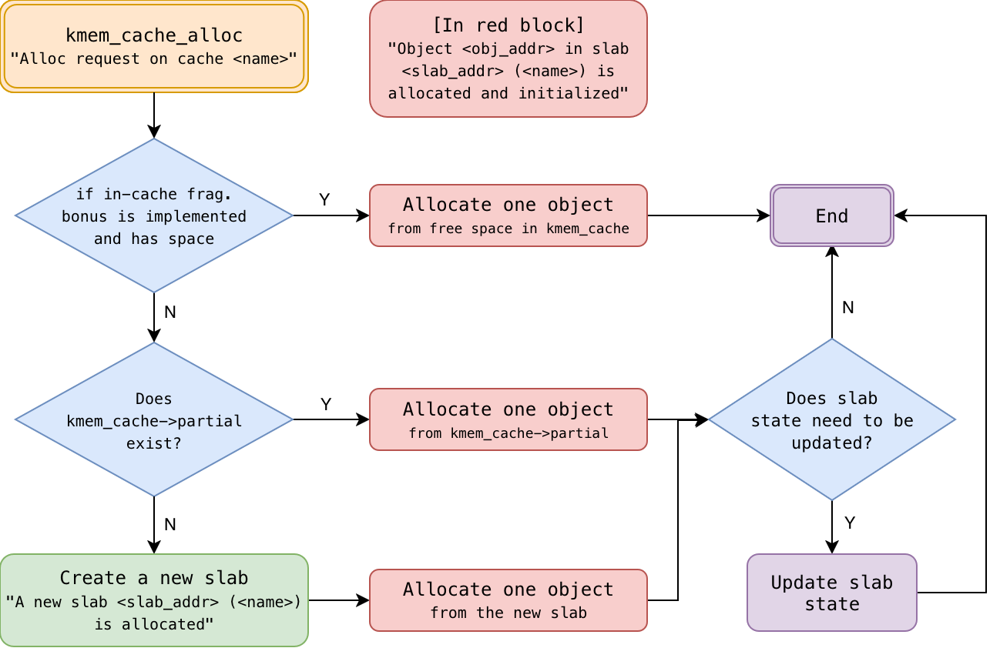
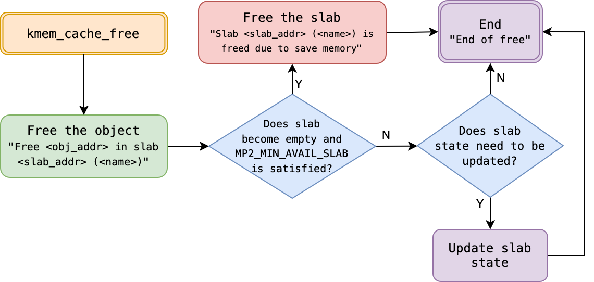

<div align="center">
  <h1>💻 Machine Problem 2 - Memory Management: Kernel Memory Allocator (Slab)</h1>
  <h3>CSIE3310 - Operating Systems</h3>
  <h4>National Taiwan University</h4>
</div>

<hr />

<div align="center">
  <table>
    <tr>
      <td><strong>Total Points:</strong></td>
      <td>100 + 30 (Bonus)</td>
      <td><strong>Release Date:</strong></td>
      <td>March 24</td>
    </tr>
    <tr>
      <td><strong>Due Date:</strong></td>
      <td>April 07, 23:59:59 (UTC+8)</td>
      <td><strong>Late Deadline:</strong></td>
      <td>April 11, 23:59:59 (UTC+8)</td>
    </tr>
    <tr>
      <td><strong>TA Hours:</strong></td>
      <td colspan="3">Wed. 13:30-14:30, Thr. 13:00-14:00 (@CSIE B04)</td>
    </tr>
  </table>
</div>

<hr />

## 📋 Table of Contents

- [💬 Discussion Policy](#-discussion-policy)
- [🎯 Assignment Overview](#-assignment-overview)
- [📈 Grading Policy](#-grading-policy)
- [⚖️ Constraints](#️-constraints)
- [⚙️ Task Specifications](#️-task-specifications)
  - [📝 Output and Formatting Specifications](#output-and-formatting-specifications-slabc)
  - [🏗️ System Integration Requirements](#system-integration-requirements)
  - [🌟 Bonus Task Specifications](#-bonus-task-specifications)
- [📖 Guide](#-guide)
- [📚 References](#references)

## 💬 Discussion Policy

If you have any questions regarding this assignment, please post them on the corresponding MP2 discussion board on NTU COOL. For personal questions and requests, please email [ntuos@googlegroups.com](mailto:ntuos@googlegroups.com).

## 🎯 Assignment Overview

In modern operating systems, the kernel frequently allocates and frees small objects (such as `struct file`). Directly requesting a full page for each object would lead to significant memory waste and performance overhead.

In this MP2 assignment, you will implement a **Slab Allocator** for the `xv6` operating system. This is a classic mechanism designed to address the challenges of small object allocation.

**Core Objectives:**

1. **Data Structure and Space Management**: Manage page memory with minimal overhead and reduce internal fragmentation.
2. **Modern Kernel Security**: Mitigate memory-based attacks—where an attacker predicts memory layouts—by implementing a dynamic randomization mechanism.

> [!NOTE]
> **Development Environment and Toolchain**:
> This assignment utilizes Docker containers and GitHub Actions for automated validation. Before starting, please carefully review:
>
> 1. [`doc/setup.md`](../doc/setup.md): Understand how to initialize the development environment.
> 2. [`doc/workflow.md`](../doc/workflow.md): Learn how to use `./mp.sh grade` to perform local testing and the git workflows.
> 3. [`doc/mp2-test.md`](./mp2-test.md): Learn how to use advanced testing commands to speed up your debugging.
> 4. [`doc/mp2-guide.md`](./mp2-guide.md): Learn what the slab system is and more technical details behind the implementation and the verification.

## 📈 Grading Policy

### 📌 Core Requirements (100%)

- **Public Tests (80%)**
  - **[Power on check (10%)](#️-task-specifications)**: Basic boot check. Ensure the kernel can boot up and execute simple commands (e.g., `echo Ok`).
  - **[Standard Integrated Tests (60%)](./mp2-guide.md#-implementation-guide)**: 20 automated tests (3% each) verifying `kmem_cache` creation, allocation, and deallocation logic across various scenarios.
  - **[Internal Fragmentation Optimization (10%)](#system-integration-requirements)**: Utilize the remaining space within the `kmem_cache` page to host objects.
- **Private Tests (20%)**
  - Stress tests focusing on edge conditions and potential data race issues. System stability must be maintained.

> [!NOTE]
> **Stability and Tolerance Policy**
> To account for potential kernel non-determinism, each **Standard Integrated Test** and **Private Test** is executed **5 times**. You only need to pass **at least one** out of the five attempts to receive the full score for that specific test case.

> [!NOTE]
> **Late Submission Policy**
> Submissions after the Due Date (April 07) but before the Late Deadline (April 11) will incur a **20% daily deduction**. Submissions after the Late Deadline will not be accepted (0 points).

### 🌟 Bonus Challenges (30%)

The bonus points are calculated independently. You can choose to challenge the following items:

> [!WARNING]
> **Bonus Scoring Eligibility**
> Bonus points will only be calculated if your <font color=red>**Public Test score is $\ge 70$**</font>.

- **[Ultimate Internal Fragmentation Bonus (+5%)](#system-integration-requirements)**: Push object capacity to the absolute limit.
- **[Linux List API Application (+5%)](#-linux-list-api-application-bonus-5)**: Use `kernel/list.h` to manage slabs.
- **[Allocation Randomization (+10%)](#️-allocation-randomization-bonus-10)**: Non-linear `freelist` and entropy verification.
- **[Spinlock Correctness (+10%)](#-spinlock-correctness-bonus-10)**: 100% pass rate under concurrent stress.

## ⚖️ Constraints

To ensure the stability and correctness of the kernel, your implementation must adhere to the following constraints:

1. **File Modification Limit**: You are allowed to modify **`student.conf`**, **`kernel/file.c`**, **`kernel/slab.h`**, and **`kernel/slab.c`**. Additionally, you are permitted to **add new header files** (`.h`) if necessary. Modifications to any other existing files are strictly prohibited and will result in a score of 0.
2. **Name Limit**: `kmem_cache::name` must accommodate at least `MP2_CACHE_MAX_NAME` (16) bytes. The kernel will check this during boot.
3. **Object Size Limit**: `kmem_cache::object_size` must be able to represent at least one full page size (`MP2_SLAB_SIZE`, 4096 bytes). The kernel will check this during boot.
4. **Slab Capacity**: Your slab system must be robust enough to allow the allocation of at least **4096 elements** in total across slabs.
5. **Memory Source**: All memory for slabs must be obtained through `kalloc()` (one page at a time).

## ⚙️ Task Specifications

### Core APIs

You must implement the following exposed operations inside `kernel/slab.c`:

```c
// 1. Initialize an allocator pool for a specific object type
struct kmem_cache *kmem_cache_create(char *name, uint object_size);

// 2. Request and return a pointer to a free object
void *kmem_cache_alloc(struct kmem_cache *cache);

// 3. Free the object back to the allocator pool for subsequent reuse
void kmem_cache_free(struct kmem_cache *cache, void *obj);

// 4. Destroy and free the physical resources occupied by the entire allocator pool
// NOTE: This function won't be tested in this assignment
void kmem_cache_destroy(struct kmem_cache *cache);

// 5. Output internal states (for test framework verification)
void print_kmem_cache(struct kmem_cache *cache);
```

### Output and Formatting Specifications (`slab.c`)

All implemented functions must output formatted strings via `printf`. The grading scripts rely on parsing these outputs; **ensure that spaces are correct and the format matches exactly**:

#### `kmem_cache_create`

<pre style="border: 1px solid #e8e8e8;padding: 10px;border-radius: 4px;font-size: 10px;line-height: 1.5;overflow-x: auto;white-space: pre-wrap;"><code>[SLAB] New kmem_cache (name: &lt;name&gt;, object size: &lt;object_size&gt; bytes, at: &lt;kmem_cache_addr&gt;, max objects per slab: &lt;max_objs&gt;, support in cache obj: &lt;in_cache_obj&gt;) is created
</code></pre>

- **`<name>`**: The name of the newly created `kmem_cache` (`kmem_cache::name`).
- **`<object_size>`**: The size of the objects inside this `kmem_cache` in bytes (`kmem_cache::object_size`).
- **`<kmem_cache_addr>`**: The memory address of the `kmem_cache`.
- **`<max_objs>`**: The maximum number of objects that a single `slab` can accommodate.
- **`<in_cache_obj>`**: If "Internal Fragmentation Optimization" is implemented, this is the maximum number of objects that fit within the `kmem_cache` page; otherwise, print `0`.

#### `kmem_cache_alloc`



- **`<name>`**: The name of the `kmem_cache` (`kmem_cache::name`).
- **`<slab_addr>`**: The memory address of the slab to which the object belongs.
- **`<obj_addr>`**: The memory address of the allocated object.

##### Received Request

```txt
[SLAB] Alloc request on cache <name>
```

##### Create New Slab (If Necessary)

```txt
[SLAB] A new slab <slab_addr> (<name>) is allocated
```

##### Return Result

```txt
[SLAB] Object <obj_addr> in slab <slab_addr> (<name>) is allocated and initialized
```

#### `kmem_cache_free`



- **`<name>`**: The name of the `kmem_cache` (`kmem_cache::name`).
- **`<slab_addr>`**: The memory address of the slab to which the object belongs.
- **`<obj_addr>`**: The memory address of the object to be freed.

##### Before Freeing

```txt
[SLAB] Free <obj_addr> in slab <slab_addr> (<name>)
```

##### Memory Collection (Voluntarily returning memory back to the machine when [partial+free] > MP2_MIN_AVAIL_SLAB)

```txt
[SLAB] Slab <slab_addr> (<name>) is freed due to save memory
```

##### Completion

```txt
[SLAB] End of free
```

#### `print_kmem_cache` (Structured Validation Output)

This function allows the grading framework to map the memory topology and verify randomization metrics. The output is parsed strictly; please follow the format exactly, including spacing:

##### 1. Basic Info

```text
[SLAB] kmem_cache { name: <name>, object_size: <object_size>, at: <kmem_cache_addr>, in_cache_obj: <in_cache_obj> }
```

##### 2. Slab Link Status

```text
[SLAB] <SPACE>[ <slab_type><SPACE>slabs ]
```

- `<SPACE>`: At least one space `" "` or tab `"\t"`.
- `<slab_type>`: slab type, can be `full`, `partial`, `free`, or `cache`.

**Note: You only need to print slabs in the `partial` state (as well as the `cache` state for internal fragmentation optimization). Slabs in the `full` or `free` states are tracked dynamically by the grading engine through the allocation history and do not need to be output.**

##### 3. Single Slab Status

```text
[SLAB] <SPACE>[ slab <slab_addr> ] { freelist: <freelist>, nxt: <next_slab_addr> }
```

##### 4. Single Core Object Status

```text
[SLAB] <SPACE>[ idx <idx> ] { addr: <entry_addr>, as_ptr: <as_ptr>, as_obj: {<as_obj>} }
```

- `<idx>`: The index of the object within its respective slab.
- `<entry_addr>`: **Output object addresses in the order they appear in the `freelist`. The grading framework uses this sequence to evaluate randomization entropy.**
- `<as_ptr>`: The value of the first 8 bytes of the object when interpreted as a pointer (i.e., the `next` pointer in the `freelist`).
- `<as_obj>`: The object interpreted in its functional context. For `struct file`, pass the object address to the provided `fileprint_metadata` function to populate this field.

##### 5. Function Terminator Symbol

```txt
[SLAB] print_kmem_cache end
```

#### Complete Output Example

To assist with formatting consistency, below is a complete output example:

<pre style="border: 1px solid #e8e8e8;padding: 10px;border-radius: 4px;font-size: 5.2px;line-height: 1.5;overflow-x: auto;white-space: pre-wrap;"><code>[SLAB] kmem_cache { name: file, object_size: 504, at: 0x0000000087f59000, in_cache_obj: 0 }
[SLAB]    [ partial slabs ]
[SLAB]        [ slab 0x0000000087f4e000 ] { freelist: 0x0000000087f4e218, nxt: 0x0000000087f59040 }
[SLAB]           [ idx 0 ] { addr: 0x0000000087f4e020, as_ptr: 0x0000000900000003, as_obj: { tp: 3, ref: 9, readable: 1, writable: 1, pipe: 0x0000000000000000, ip: 0x00000000800354c8, off: 0, major: 1 } }
[SLAB]           [ idx 1 ] { addr: 0x0000000087f4e218, as_ptr: 0x0000000087f4e410, as_obj: { tp: -2013993968, ref: 0, readable: 1, writable: 0, pipe: 0x0000000000000000, ip: 0x0000000080035440, off: 1024, major: 0 } }
[SLAB]           [ idx 2 ] { addr: 0x0000000087f4e410, as_ptr: 0x0000000087f4e608, as_obj: { tp: -2013993464, ref: 0, readable: 1, writable: 0, pipe: 0x0000000000000000, ip: 0x00000000800354c8, off: 0, major: 1 } }
[SLAB]           [ idx 3 ] { addr: 0x0000000087f4e608, as_ptr: 0x0000000087f4e800, as_obj: { tp: -2013992960, ref: 0, readable: 5, writable: 5, pipe: 0x0505050505050505, ip: 0x0505050505050505, off: 84215045, major: 1285 } }
[SLAB]           [ idx 4 ] { addr: 0x0000000087f4e800, as_ptr: 0x0000000087f4e9f8, as_obj: { tp: -2013992456, ref: 0, readable: 5, writable: 5, pipe: 0x0505050505050505, ip: 0x0505050505050505, off: 84215045, major: 1285 } }
[SLAB]           [ idx 5 ] { addr: 0x0000000087f4e9f8, as_ptr: 0x0000000087f4ebf0, as_obj: { tp: -2013991952, ref: 0, readable: 5, writable: 5, pipe: 0x0505050505050505, ip: 0x0505050505050505, off: 84215045, major: 1285 } }
[SLAB]           [ idx 6 ] { addr: 0x0000000087f4ebf0, as_ptr: 0x0000000087f4ede8, as_obj: { tp: -2013991448, ref: 0, readable: 5, writable: 5, pipe: 0x0505050505050505, ip: 0x0505050505050505, off: 84215045, major: 1285 } }
[SLAB]           [ idx 7 ] { addr: 0x0000000087f4ede8, as_ptr: 0x0000000000000000, as_obj: { tp: 0, ref: 0, readable: 5, writable: 5, pipe: 0x0505050505050505, ip: 0x0505050505050505, off: 84215045, major: 1285 } }
[SLAB] print_kmem_cache end
</code></pre>

<pre style="border: 1px solid #e8e8e8;padding: 10px;border-radius: 4px;font-size: 5.2px;line-height: 1.5;overflow-x: auto;white-space: pre-wrap;"><code>[SLAB] kmem_cache { name: file, object_size: 504, at: 0x0000000087f59000, in_cache_obj: 0 }
[SLAB]    [ partial slabs ]
[SLAB]        [ slab 0x0000000087e5d000 ] { freelist: 0x0000000087e5d020, nxt: 0x0000000087f4e008 }
[SLAB]           [ idx 0 ] { addr: 0x0000000087e5d020, as_ptr: 0x0000000087e5d410, as_obj: { tp: -2014981104, ref: 0, readable: 1, writable: 0, pipe: 0x0000000000000000, ip: 0x0000000080035440, off: 1024, major: 0 } }
[SLAB]           [ idx 1 ] { addr: 0x0000000087e5d218, as_ptr: 0x0000000000000000, as_obj: { tp: 0, ref: 0, readable: 0, writable: 1, pipe: 0x0000000087e5c000, ip: 0x0000000000000000, off: 0, major: 0 } }
[SLAB]           [ idx 2 ] { addr: 0x0000000087e5d410, as_ptr: 0x0000000087e5d800, as_obj: { tp: -2014980096, ref: 0, readable: 1, writable: 0, pipe: 0x0000000000000000, ip: 0x0000000080035550, off: 0, major: 0 } }
[SLAB]           [ idx 3 ] { addr: 0x0000000087e5d608, as_ptr: 0x0000000087e5d218, as_obj: { tp: -2014981608, ref: 0, readable: 0, writable: 1, pipe: 0x0000000087e20000, ip: 0x0000000000000000, off: 0, major: 0 } }
[SLAB]           [ idx 4 ] { addr: 0x0000000087e5d800, as_ptr: 0x0000000087e5dbf0, as_obj: { tp: -2014979088, ref: 0, readable: 1, writable: 0, pipe: 0x0000000087de5000, ip: 0x0000000000000000, off: 0, major: 0 } }
[SLAB]           [ idx 5 ] { addr: 0x0000000087e5d9f8, as_ptr: 0x0000000087e5d608, as_obj: { tp: -2014980600, ref: 0, readable: 0, writable: 1, pipe: 0x0000000087de5000, ip: 0x0000000000000000, off: 0, major: 0 } }
[SLAB]           [ idx 6 ] { addr: 0x0000000087e5dbf0, as_ptr: 0x0000000087e5dde8, as_obj: { tp: -2014978584, ref: 0, readable: 1, writable: 0, pipe: 0x0000000087daa000, ip: 0x0000000000000000, off: 0, major: 0 } }
[SLAB]           [ idx 7 ] { addr: 0x0000000087e5dde8, as_ptr: 0x0000000087e5d9f8, as_obj: { tp: -2014979592, ref: 0, readable: 0, writable: 1, pipe: 0x0000000000000000, ip: 0x00000000800355d8, off: 5, major: 0 } }
[SLAB]        [ slab 0x0000000087f4e000 ] { freelist: 0x0000000087f4e218, nxt: 0x0000000087f59040 }
[SLAB]           [ idx 0 ] { addr: 0x0000000087f4e020, as_ptr: 0x0000000900000003, as_obj: { tp: 3, ref: 9, readable: 1, writable: 1, pipe: 0x0000000000000000, ip: 0x00000000800354c8, off: 0, major: 1 } }
[SLAB]           [ idx 1 ] { addr: 0x0000000087f4e218, as_ptr: 0x0000000087f4e608, as_obj: { tp: -2013993464, ref: 0, readable: 1, writable: 0, pipe: 0x0000000087f42000, ip: 0x0000000000000000, off: 0, major: 0 } }
[SLAB]           [ idx 2 ] { addr: 0x0000000087f4e410, as_ptr: 0x0000000087f4ebf0, as_obj: { tp: -2013991952, ref: 0, readable: 1, writable: 0, pipe: 0x0000000087eeb000, ip: 0x0000000000000000, off: 0, major: 0 } }
[SLAB]           [ idx 3 ] { addr: 0x0000000087f4e608, as_ptr: 0x0000000087f4e410, as_obj: { tp: -2013993968, ref: 0, readable: 1, writable: 0, pipe: 0x0000000087ee5000, ip: 0x0000000000000000, off: 0, major: 0 } }
[SLAB]           [ idx 4 ] { addr: 0x0000000087f4e800, as_ptr: 0x0000000087f4e9f8, as_obj: { tp: -2013992456, ref: 0, readable: 0, writable: 1, pipe: 0x0000000000000000, ip: 0x00000000800355d8, off: 5, major: 0 } }
[SLAB]           [ idx 5 ] { addr: 0x0000000087f4e9f8, as_ptr: 0x0000000000000000, as_obj: { tp: 0, ref: 0, readable: 0, writable: 1, pipe: 0x0000000087eeb000, ip: 0x0000000000000000, off: 0, major: 0 } }
[SLAB]           [ idx 6 ] { addr: 0x0000000087f4ebf0, as_ptr: 0x0000000087f4ede8, as_obj: { tp: -2013991448, ref: 0, readable: 1, writable: 0, pipe: 0x0000000087e98000, ip: 0x0000000000000000, off: 0, major: 0 } }
[SLAB]           [ idx 7 ] { addr: 0x0000000087f4ede8, as_ptr: 0x0000000087f4e800, as_obj: { tp: -2013992960, ref: 0, readable: 0, writable: 1, pipe: 0x0000000000000000, ip: 0x0000000080035550, off: 5, major: 0 } }
[SLAB] print_kmem_cache end
</code></pre>

<pre style="border: 1px solid #e8e8e8;padding: 10px;border-radius: 4px;font-size: 5.2px;line-height: 1.5;overflow-x: auto;white-space: pre-wrap;"><code>[SLAB] kmem_cache { name: file, object_size: 504, at: 0x0000000087f59000, in_cache_obj: 8 }
[SLAB]    [ cache    slabs ]
[SLAB]        [ slab 0x0000000087f59000 ] { freelist: 0x0000000087f59430, nxt: 0x0000000000000000, max_objs: 8 }
[SLAB]           [ idx 0 ] { addr: 0x0000000087f59040, as_ptr: 0x0000000087f59628, as_obj: { tp: -2013948376, ref: 0, readable: 5, writable: 5, pipe: 0x0505050505050505, ip: 0x0505050505050505, off: 84215045, major: 1285 } }
[SLAB]           [ idx 1 ] { addr: 0x0000000087f59238, as_ptr: 0x0000000000000000, as_obj: { tp: 0, ref: 0, readable: 5, writable: 5, pipe: 0x0505050505050505, ip: 0x0505050505050505, off: 84215045, major: 1285 } }
[SLAB]           [ idx 2 ] { addr: 0x0000000087f59430, as_ptr: 0x0000000087f59e08, as_obj: { tp: -2013946360, ref: 0, readable: 1, writable: 1, pipe: 0x0000000000000000, ip: 0x000000008001f340, off: 0, major: 1 } }
[SLAB]           [ idx 3 ] { addr: 0x0000000087f59628, as_ptr: 0x0000000087f59a18, as_obj: { tp: -2013947368, ref: 0, readable: 5, writable: 5, pipe: 0x0505050505050505, ip: 0x0505050505050505, off: 84215045, major: 1285 } }
[SLAB]           [ idx 4 ] { addr: 0x0000000087f59820, as_ptr: 0x0000000900000003, as_obj: { tp: 3, ref: 9, readable: 1, writable: 1, pipe: 0x0000000000000000, ip: 0x000000008001f340, off: 0, major: 1 } }
[SLAB]           [ idx 5 ] { addr: 0x0000000087f59a18, as_ptr: 0x0000000087f59c10, as_obj: { tp: -2013946864, ref: 0, readable: 5, writable: 5, pipe: 0x0505050505050505, ip: 0x0505050505050505, off: 84215045, major: 1285 } }
[SLAB]           [ idx 6 ] { addr: 0x0000000087f59c10, as_ptr: 0x0000000087f59238, as_obj: { tp: -2013949384, ref: 0, readable: 5, writable: 5, pipe: 0x0505050505050505, ip: 0x0505050505050505, off: 84215045, major: 1285 } }
[SLAB]           [ idx 7 ] { addr: 0x0000000087f59e08, as_ptr: 0x0000000087f59040, as_obj: { tp: -2013949888, ref: 0, readable: 5, writable: 5, pipe: 0x0505050505050505, ip: 0x0505050505050505, off: 84215045, major: 1285 } }
[SLAB] print_kmem_cache end
</code></pre>

### System Integration Requirements

#### Kernel System Integration (`file.c`)

In the original `xv6` implementation, the system uses a static array `ftable` in `kernel/file.c` to manage all file objects. In this assignment, you must replace this static management with your dynamic slab allocator:

1. **Initialization**: During kernel boot (e.g., in `fileinit()`), call `kmem_cache_create("file", sizeof(struct file))` to initialize the allocator.
2. **Dynamic Allocation**: Replace any code that searches through the static `ftable.file` array with a call to `kmem_cache_alloc(file_cache)`.
3. **Dynamic Deallocation**: When a file is no longer needed (e.g., in `fileclose()`), return the object to the pool using `kmem_cache_free(file_cache, f)`.

> [!IMPORTANT]
> **Cache Name Requirement**: The name used in `kmem_cache_create` MUST be exactly `"file"` for the grading scripts to identify it.

#### Internal Fragmentation Optimization

Utilize the remaining space within the single page obtained during `kmem_cache` allocation (aside from storing the `struct kmem_cache` itself) to allocate objects (e.g., `struct file`).

Grading Policy: You will receive scores corresponding to how many extra `struct file`s you can seamlessly cram into the `kmem_cache`'s page. Below is the reference scoring table:

| Extra `struct file`s<br>allocatable in `kmem_cache` | 0 | 1~3 | 4~6 | 7 | 8<br>(bonus) |
| :---: | :---: | :---: | :---: | :---: | :---: |
| Score (10%)<br>with extra bonus (+5%) | 0 | 2 | 5 | 10 | 10 + 5 |

**Note**: It is possible to fit up to eight `struct file`s within the page containing the `struct kmem_cache`. The TAs will NOT provide hints regarding this implementation; please use your creativity to maximize memory utilization.

### 🌟 Bonus Task Specifications

#### 🐧 Linux List API Application (Bonus +5%)

In high-performance kernel development, manually managing pointers for linked lists is error-prone. You are encouraged to use the **Linux-styled intrusive linked list** provided in `kernel/list.h`.

- **Requirement**: Use `struct list_head` to manage the linked lists of slabs (full, partial, free) within `struct kmem_cache`.
- **Scoring**: Correctly utilize `list_add`, `list_del`, `list_for_each_entry` and other macros provided. Your implementation should be clean and follow the "intrusive list" pattern (see [mp2-guide](./mp2-guide.md#-linux-styled-list-api) for more details).

#### 🛡️ Allocation Randomization (Bonus +10%)

To mitigate heap-based attacks, the order of objects returned by the allocator should be unpredictable.

1. **Structural Non-linearity (+5%)**:
   - The memory addresses of objects in the `freelist` **chain** (the sequence of objects visited by following the `next` pointers) must not be strictly ascending or descending.
   - Validation: The sequence of `addr` output in `print_kmem_cache` (following the `freelist` link) will be parsed to verify it is non-monotonic.
2. **Entropy Verification (+5%)**:
   - Your shuffling algorithm (e.g., Fisher-Yates) must demonstrate sufficient randomness.
   - Validation: The grading script calculates the **number of inversions** in the address sequence. A passing grade requires the result to fall within the range of **[8, 20]** (for a standard slab). This evaluation is performed over 10 trials, and you must pass at least **5 out of 10** to receive this bonus.

#### 🔒 Spinlock Correctness (Bonus +10%)

Ensure your allocator is thread-safe and free from race conditions on multi-core systems.

- **Requirement**: Achieve a 100% pass rate (5/5 for every test case) across **ALL Public Tests** in the official grading environment.
- **Validation**: Every test case will be executed multiple times. This bonus is awarded only if no failures or deadlocks occur across all runs.

For more technical detail guides, please check the [Concurrency and Synchronization](./mp2-guide.md#-concurrency-and-synchronization).

## 📖 Guide

### 🚀 Technical Background & Guide

For detailed technical background, implementation logic, and security requirements, please refer to the dedicated guide:

👉 **[MP2 Implementation Guide (doc/mp2-guide.md)](./mp2-guide.md)**

### 🧪 Testing Commands

Learn how to use `./mp.sh test` with substring matching to run specific and customized test cases, saving time during development:

👉 **[MP2 Testing Commands Guide (doc/mp2-test.md)](./mp2-test.md)**

# References

1. [xv6: a simple, Unix-like teaching operating system](https://pdos.csail.mit.edu/6.828/2023/xv6/book-riscv-rev3.pdf)
2. [ISO/IEC 9899:2024 (C Language Specification)](https://www.open-std.org/jtc1/sc22/wg14/www/docs/n3220.pdf)
3. [`linux/mm/slab.h`](https://github.com/torvalds/linux/blob/master/mm/slab.h)
4. [`linux/mm/slub.c`](https://github.com/torvalds/linux/blob/master/mm/slub.c#L154)
5. [`sysprog21/lab0-c`](https://github.com/sysprog21/lab0-c/blob/master/list.h)
6. [`linux/include/linux/list.h`](https://github.com/torvalds/linux/blob/master/include/linux/list.h)
7. [Slab Memory Allocator](https://hackmd.io/5Fn8N3HeRkGIO7cZu7chIw?view#slab-%E8%A8%98%E6%86%B6%E9%AB%94%E9%85%8D%E7%BD%AE%E5%99%A8)

> **Get started!** Wishing everyone a great time navigating the challenge of memory allocators.
